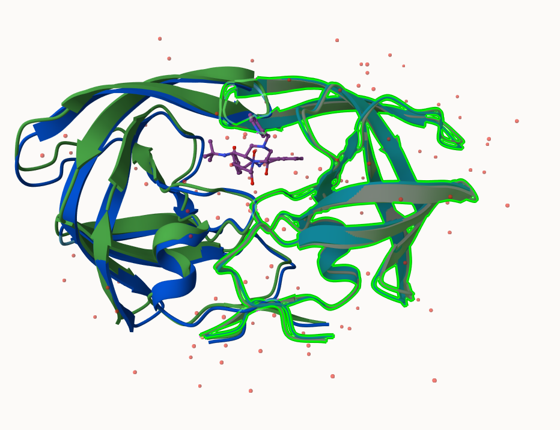
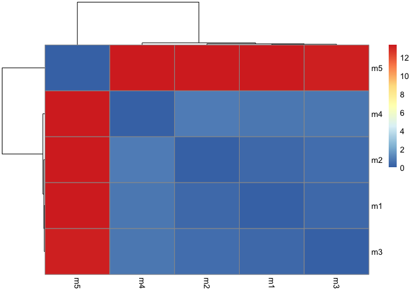
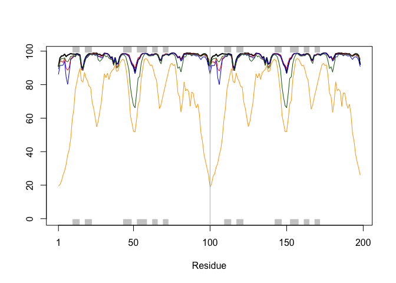
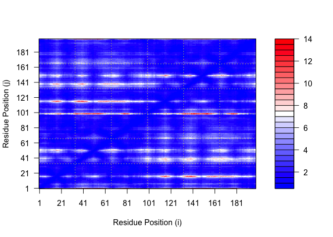
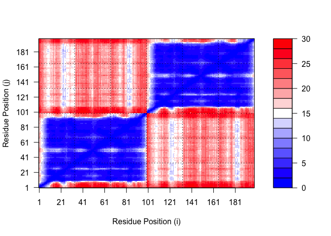
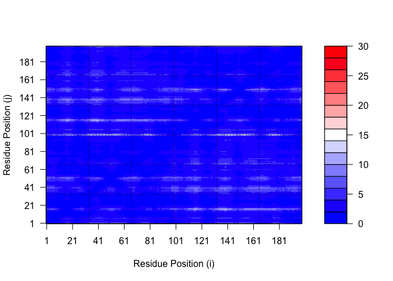

# Class11: AlphaFold
Kyle Wittkop (A18592410)

- [Backround](#backround)
- [AlphaFold](#alphafold)
- [The EBI AlphaFold database](#the-ebi-alphafold-database)
- [Running AlphaFold](#running-alphafold)
- [Interpreting Results](#interpreting-results)
- [Listing of all PAE JSON files](#listing-of-all-pae-json-files)

## Backround

We saw last lab that the main repository for biomolecular structure (the
PDB data base) only has under 250,000 entries

UniprotKB (the main protein sequence data base) has over 200 million
entries!

## AlphaFold

In this hands-on session we will utilize AlphaFold to predict protein
structure from sequence (Jumper et al. 2021).

Without the aid of such approaches, it can take years of expensive
laboratory work to determine the structure of just one protein. With
AlphaFold we can now accurately compute a typical protein structure in
as little as ten minutes.

## The EBI AlphaFold database

The EBI AlphaFold data base contains lots of computed structure models.
it is increasingly likley that the structure you are interested in is
already in this database \< https://alphafold.ebi.ac.uk/ \>

There are 3 major outputs from alphafold

1.  A model of the structure in **PDB format**
2.  a **pLDDT score** that tells us how confident the model is for a
    given residue in your protein
3.  a **PAE score** that tells us about protein packing quality

If you cant find a matching entry - the sequence you are interested in
AFDB you can run Alphafold yourself…

## Running AlphaFold

We will use Colabfold to run alphafold



## Interpreting Results

Custom Analysis we can read all of the alpha fold results into R and do
more quantative analysis than just revewing the structures in mol-star.

``` r
results_dir <- "HIVPR_23119/" 

pdb_files <- list.files(path=results_dir,
                        pattern="*.pdb",
                        full.names = TRUE)

basename(pdb_files)
```

    [1] "HIVPR_23119_unrelaxed_rank_001_alphafold2_multimer_v3_model_2_seed_000.pdb"
    [2] "HIVPR_23119_unrelaxed_rank_002_alphafold2_multimer_v3_model_4_seed_000.pdb"
    [3] "HIVPR_23119_unrelaxed_rank_003_alphafold2_multimer_v3_model_1_seed_000.pdb"
    [4] "HIVPR_23119_unrelaxed_rank_004_alphafold2_multimer_v3_model_5_seed_000.pdb"
    [5] "HIVPR_23119_unrelaxed_rank_005_alphafold2_multimer_v3_model_3_seed_000.pdb"

``` r
library(bio3d)
pdbs <- pdbaln(pdb_files, fit=TRUE, exefile="msa")
```

    Reading PDB files:
    HIVPR_23119//HIVPR_23119_unrelaxed_rank_001_alphafold2_multimer_v3_model_2_seed_000.pdb
    HIVPR_23119//HIVPR_23119_unrelaxed_rank_002_alphafold2_multimer_v3_model_4_seed_000.pdb
    HIVPR_23119//HIVPR_23119_unrelaxed_rank_003_alphafold2_multimer_v3_model_1_seed_000.pdb
    HIVPR_23119//HIVPR_23119_unrelaxed_rank_004_alphafold2_multimer_v3_model_5_seed_000.pdb
    HIVPR_23119//HIVPR_23119_unrelaxed_rank_005_alphafold2_multimer_v3_model_3_seed_000.pdb
    .....

    Extracting sequences

    pdb/seq: 1   name: HIVPR_23119//HIVPR_23119_unrelaxed_rank_001_alphafold2_multimer_v3_model_2_seed_000.pdb 
    pdb/seq: 2   name: HIVPR_23119//HIVPR_23119_unrelaxed_rank_002_alphafold2_multimer_v3_model_4_seed_000.pdb 
    pdb/seq: 3   name: HIVPR_23119//HIVPR_23119_unrelaxed_rank_003_alphafold2_multimer_v3_model_1_seed_000.pdb 
    pdb/seq: 4   name: HIVPR_23119//HIVPR_23119_unrelaxed_rank_004_alphafold2_multimer_v3_model_5_seed_000.pdb 
    pdb/seq: 5   name: HIVPR_23119//HIVPR_23119_unrelaxed_rank_005_alphafold2_multimer_v3_model_3_seed_000.pdb 

``` r
#pdbs
```

How similar and how different are my models

``` r
rd <- rmsd(pdbs, fit=T)
```

    Warning in rmsd(pdbs, fit = T): No indices provided, using the 198 non NA positions

``` r
range(rd)
```

    [1]  0.000 13.383

``` r
library(pheatmap)

colnames(rd) <- paste0("m",1:5)
rownames(rd) <- paste0("m",1:5)
pheatmap(rd)
```



Plotting pLDDT values

``` r
pdb <- read.pdb("1hsg")
```

      Note: Accessing on-line PDB file

``` r
plotb3(pdbs$b[1,], typ="l", lwd=2, sse=pdb)
points(pdbs$b[2,], typ="l", col="red")
points(pdbs$b[3,], typ="l", col="blue")
points(pdbs$b[4,], typ="l", col="darkgreen")
points(pdbs$b[5,], typ="l", col="orange")
abline(v=100, col="gray")
```



Predicted Alignment Error for domains

# Listing of all PAE JSON files

``` r
library(jsonlite)

pae_files <- list.files(path=results_dir,
                        pattern=".*model.*\\.json",
                        full.names = TRUE)
```

``` r
pae1 <- read_json(pae_files[1],simplifyVector = TRUE)
pae5 <- read_json(pae_files[5],simplifyVector = TRUE)

attributes(pae1)
```

    $names
    [1] "plddt"   "max_pae" "pae"     "ptm"     "iptm"   

``` r
library(bio3d)
plot.dmat(pae1$pae, 
          xlab="Residue Position (i)",
          ylab="Residue Position (j)")
```



``` r
plot.dmat(pae5$pae, 
          xlab="Residue Position (i)",
          ylab="Residue Position (j)",
          grid.col = "black",
          zlim=c(0,30))
```



``` r
plot.dmat(pae1$pae, 
          xlab="Residue Position (i)",
          ylab="Residue Position (j)",
          grid.col = "black",
          zlim=c(0,30))
```


