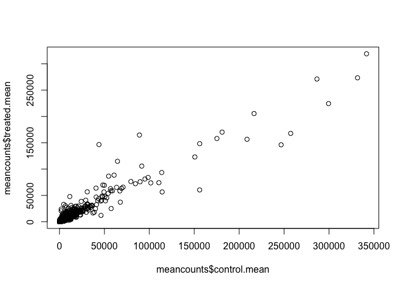
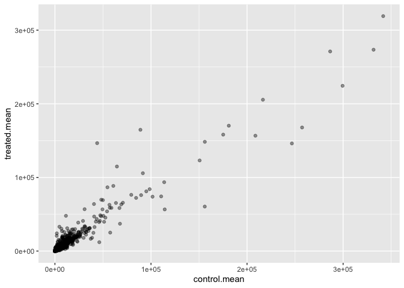
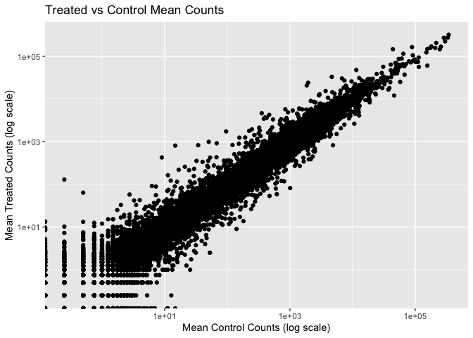
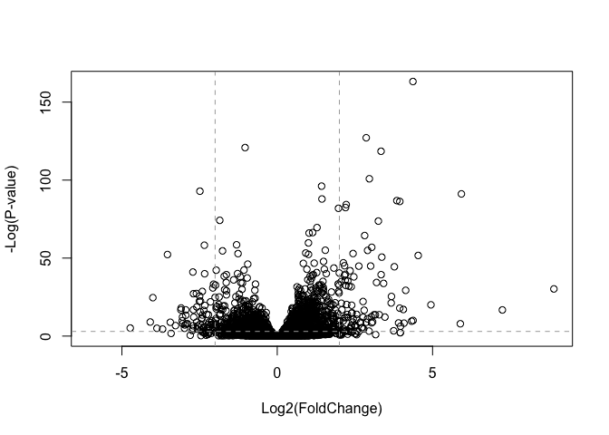
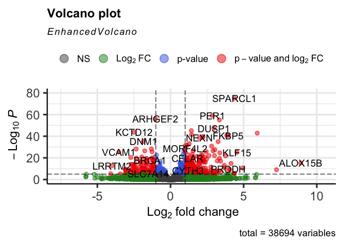

# Class13
Kyle Wittkop (A18592410)

- [1. Background](#background)
- [2. Bioconductor setup](#bioconductor-setup)
- [3. Import countData and colData](#import-countdata-and-coldata)
- [4. Toy differential gene
  expression](#toy-differential-gene-expression)
- [5. Setting up for DESeq](#setting-up-for-deseq)
- [6. Principal Component Analysis
  (PCA)](#principal-component-analysis-pca)
- [7. DESeq analysis](#deseq-analysis)
- [8. Adding annotation data](#adding-annotation-data)
- [Save annotated results to a CSV
  file](#save-annotated-results-to-a-csv-file)
- [9. Data Visualization](#data-visualization)
- [10. Pathway analysis](#pathway-analysis)
- [look at the first three (less)
  Pathways](#look-at-the-first-three-less-pathways)
  - [Graft-versus-host disease](#graft-versus-host-disease)
  - [Type I diabetes mellitus](#type-i-diabetes-mellitus)

## 1. Background

The data for this hands-on session comes from a published RNA-seq
experiment where airway smooth muscle cells were treated with
dexamethasone, a synthetic glucocorticoid steroid with anti-inflammatory
effects (Himes et al. 2014).

## 2. Bioconductor setup

``` r
library(BiocManager)
library(DESeq2)
```

    Loading required package: S4Vectors

    Loading required package: stats4

    Loading required package: BiocGenerics

    Loading required package: generics


    Attaching package: 'generics'

    The following objects are masked from 'package:base':

        as.difftime, as.factor, as.ordered, intersect, is.element, setdiff,
        setequal, union


    Attaching package: 'BiocGenerics'

    The following objects are masked from 'package:stats':

        IQR, mad, sd, var, xtabs

    The following objects are masked from 'package:base':

        anyDuplicated, aperm, append, as.data.frame, basename, cbind,
        colnames, dirname, do.call, duplicated, eval, evalq, Filter, Find,
        get, grep, grepl, is.unsorted, lapply, Map, mapply, match, mget,
        order, paste, pmax, pmax.int, pmin, pmin.int, Position, rank,
        rbind, Reduce, rownames, sapply, saveRDS, table, tapply, unique,
        unsplit, which.max, which.min


    Attaching package: 'S4Vectors'

    The following object is masked from 'package:utils':

        findMatches

    The following objects are masked from 'package:base':

        expand.grid, I, unname

    Loading required package: IRanges

    Loading required package: GenomicRanges

    Loading required package: Seqinfo

    Loading required package: SummarizedExperiment

    Loading required package: MatrixGenerics

    Loading required package: matrixStats


    Attaching package: 'MatrixGenerics'

    The following objects are masked from 'package:matrixStats':

        colAlls, colAnyNAs, colAnys, colAvgsPerRowSet, colCollapse,
        colCounts, colCummaxs, colCummins, colCumprods, colCumsums,
        colDiffs, colIQRDiffs, colIQRs, colLogSumExps, colMadDiffs,
        colMads, colMaxs, colMeans2, colMedians, colMins, colOrderStats,
        colProds, colQuantiles, colRanges, colRanks, colSdDiffs, colSds,
        colSums2, colTabulates, colVarDiffs, colVars, colWeightedMads,
        colWeightedMeans, colWeightedMedians, colWeightedSds,
        colWeightedVars, rowAlls, rowAnyNAs, rowAnys, rowAvgsPerColSet,
        rowCollapse, rowCounts, rowCummaxs, rowCummins, rowCumprods,
        rowCumsums, rowDiffs, rowIQRDiffs, rowIQRs, rowLogSumExps,
        rowMadDiffs, rowMads, rowMaxs, rowMeans2, rowMedians, rowMins,
        rowOrderStats, rowProds, rowQuantiles, rowRanges, rowRanks,
        rowSdDiffs, rowSds, rowSums2, rowTabulates, rowVarDiffs, rowVars,
        rowWeightedMads, rowWeightedMeans, rowWeightedMedians,
        rowWeightedSds, rowWeightedVars

    Loading required package: Biobase

    Welcome to Bioconductor

        Vignettes contain introductory material; view with
        'browseVignettes()'. To cite Bioconductor, see
        'citation("Biobase")', and for packages 'citation("pkgname")'.


    Attaching package: 'Biobase'

    The following object is masked from 'package:MatrixGenerics':

        rowMedians

    The following objects are masked from 'package:matrixStats':

        anyMissing, rowMedians

## 3. Import countData and colData

``` r
counts <- read.csv("airway_scaledcounts.csv", row.names=1)
metadata <-  read.csv("airway_metadata.csv")
```

``` r
head(counts)
```

                    SRR1039508 SRR1039509 SRR1039512 SRR1039513 SRR1039516
    ENSG00000000003        723        486        904        445       1170
    ENSG00000000005          0          0          0          0          0
    ENSG00000000419        467        523        616        371        582
    ENSG00000000457        347        258        364        237        318
    ENSG00000000460         96         81         73         66        118
    ENSG00000000938          0          0          1          0          2
                    SRR1039517 SRR1039520 SRR1039521
    ENSG00000000003       1097        806        604
    ENSG00000000005          0          0          0
    ENSG00000000419        781        417        509
    ENSG00000000457        447        330        324
    ENSG00000000460         94        102         74
    ENSG00000000938          0          0          0

> Q1. How many genes are in this dataset?

``` r
nrow(counts)
```

    [1] 38694

38694

> Q2. How many ‘control’ cell lines do we have?

``` r
control <- metadata[metadata[,"dex"]=="control",]
control.counts <- counts[ ,control$id]
control.mean <- rowSums( control.counts )/4 
head(control.mean)
```

    ENSG00000000003 ENSG00000000005 ENSG00000000419 ENSG00000000457 ENSG00000000460 
             900.75            0.00          520.50          339.75           97.25 
    ENSG00000000938 
               0.75 

## 4. Toy differential gene expression

> Q3. How would you make the above code in either approach more robust?
> Is there a function that could help here?

``` r
control <- metadata[metadata$dex == "control", ]
control.counts <- counts[, control$id]
control.mean <- rowMeans(control.counts)
head(control.mean)
```

    ENSG00000000003 ENSG00000000005 ENSG00000000419 ENSG00000000457 ENSG00000000460 
             900.75            0.00          520.50          339.75           97.25 
    ENSG00000000938 
               0.75 

> Q4. Follow the same procedure for the treated samples (i.e. calculate
> the mean per gene across drug treated samples and assign to a labeled
> vector called treated.mean)

``` r
treated <- metadata[metadata[,"dex"]=="treated",]
treated.counts <- counts[ ,treated$id]
treated.mean <- rowSums( treated.counts )/4 
head(treated.mean)
```

    ENSG00000000003 ENSG00000000005 ENSG00000000419 ENSG00000000457 ENSG00000000460 
             658.00            0.00          546.00          316.50           78.75 
    ENSG00000000938 
               0.00 

``` r
meancounts <- data.frame(control.mean, treated.mean)
```

> Q5 (a). Create a scatter plot showing the mean of the treated samples
> against the mean of the control samples. Your plot should look
> something like the following.

``` r
plot(meancounts$control.mean,
     meancounts$treated.mean)
```



> Q5 (b).You could also use the ggplot2 package to make this figure
> producing the plot below. What geom\_?() function would you use for
> this plot?

we would use geome_scatter

``` r
library(ggplot2)
ggplot(meancounts, aes(x = control.mean, y = treated.mean)) +
  geom_point(alpha=0.4) 
```



> Q6. Try plotting both axes on a log scale. What is the argument to
> plot() that allows you to do this?

scale_x_log10() and scale_y_log10() allows us to do this

``` r
library(ggplot2)

ggplot(meancounts, aes(x = control.mean, y = treated.mean)) +
  geom_point() +
  scale_x_log10() +
  scale_y_log10() +
  labs(
    x = "Mean Control Counts (log scale)",
    y = "Mean Treated Counts (log scale)",
    title = "Treated vs Control Mean Counts"
  )
```

    Warning in scale_x_log10(): log-10 transformation introduced infinite values.

    Warning in scale_y_log10(): log-10 transformation introduced infinite values.



``` r
meancounts$log2fc <- log2(meancounts[,"treated.mean"]/meancounts[,"control.mean"])
head(meancounts)
```

                    control.mean treated.mean      log2fc
    ENSG00000000003       900.75       658.00 -0.45303916
    ENSG00000000005         0.00         0.00         NaN
    ENSG00000000419       520.50       546.00  0.06900279
    ENSG00000000457       339.75       316.50 -0.10226805
    ENSG00000000460        97.25        78.75 -0.30441833
    ENSG00000000938         0.75         0.00        -Inf

``` r
zero.vals <- which(meancounts[,1:2]==0, arr.ind=TRUE)

to.rm <- unique(zero.vals[,1])
mycounts <- meancounts[-to.rm,]
head(mycounts)
```

                    control.mean treated.mean      log2fc
    ENSG00000000003       900.75       658.00 -0.45303916
    ENSG00000000419       520.50       546.00  0.06900279
    ENSG00000000457       339.75       316.50 -0.10226805
    ENSG00000000460        97.25        78.75 -0.30441833
    ENSG00000000971      5219.00      6687.50  0.35769358
    ENSG00000001036      2327.00      1785.75 -0.38194109

> Q7. What is the purpose of the arr.ind argument in the which()
> function call above? Why would we then take the first column of the
> output and need to call the unique() function?

The arr.ind argument makes which() give us a row and columns that allows
us to see both gene and which sample satisfy the condition. We can then
take the first column of the output to get only the genes. Because the
same gene can meet the condition in multiple samples, it can appear
multiple times so we use unique() so it would only be counted once.

``` r
up.ind <- mycounts$log2fc > 2
down.ind <- mycounts$log2fc < (-2)
#up.ind
#down.ind
```

> Q8. Using the up.ind vector above can you determine how many up
> regulated genes we have at the greater than 2 fc level?

``` r
sum(up.ind)
```

    [1] 250

250

> Q9. Using the down.ind vector above can you determine how many down
> regulated genes we have at the greater than 2 fc level?

``` r
sum(down.ind)
```

    [1] 367

367

> Q10. Do you trust these results? Why or why not?

No we cant trust these results yet because they’re based only on fold
change and we dont know if they are statistically significant. We
haven’t calculated p-values, so the results might be misleading.

## 5. Setting up for DESeq

``` r
{message=FALSE}
library(DESeq2)
citation("DESeq2")
```

    To cite package 'DESeq2' in publications use:

      Love, M.I., Huber, W., Anders, S. Moderated estimation of fold change
      and dispersion for RNA-seq data with DESeq2 Genome Biology 15(12):550
      (2014)

    A BibTeX entry for LaTeX users is

      @Article{,
        title = {Moderated estimation of fold change and dispersion for RNA-seq data with DESeq2},
        author = {Michael I. Love and Wolfgang Huber and Simon Anders},
        year = {2014},
        journal = {Genome Biology},
        doi = {10.1186/s13059-014-0550-8},
        volume = {15},
        issue = {12},
        pages = {550},
      }

``` r
dds <- DESeqDataSetFromMatrix(countData=counts, 
                              colData=metadata, 
                              design=~dex)
```

    converting counts to integer mode

    Warning in DESeqDataSet(se, design = design, ignoreRank): some variables in
    design formula are characters, converting to factors

``` r
dds
```

    class: DESeqDataSet 
    dim: 38694 8 
    metadata(1): version
    assays(1): counts
    rownames(38694): ENSG00000000003 ENSG00000000005 ... ENSG00000283120
      ENSG00000283123
    rowData names(0):
    colnames(8): SRR1039508 SRR1039509 ... SRR1039520 SRR1039521
    colData names(4): id dex celltype geo_id

## 6. Principal Component Analysis (PCA)

``` r
vsd <- vst(dds, blind = FALSE)
plotPCA(vsd, intgroup = c("dex"))
```

    using ntop=500 top features by variance


``` r
pcaData <- plotPCA(vsd, intgroup=c("dex"), returnData=TRUE)
```

    using ntop=500 top features by variance

``` r
head(pcaData)
```

                      PC1        PC2   group       name         id     dex celltype
    SRR1039508 -17.607922 -10.225252 control SRR1039508 SRR1039508 control   N61311
    SRR1039509   4.996738  -7.238117 treated SRR1039509 SRR1039509 treated   N61311
    SRR1039512  -5.474456  -8.113993 control SRR1039512 SRR1039512 control  N052611
    SRR1039513  18.912974  -6.226041 treated SRR1039513 SRR1039513 treated  N052611
    SRR1039516 -14.729173  16.252000 control SRR1039516 SRR1039516 control  N080611
    SRR1039517   7.279863  21.008034 treated SRR1039517 SRR1039517 treated  N080611
                   geo_id sizeFactor
    SRR1039508 GSM1275862  1.0193796
    SRR1039509 GSM1275863  0.9005653
    SRR1039512 GSM1275866  1.1784239
    SRR1039513 GSM1275867  0.6709854
    SRR1039516 GSM1275870  1.1731984
    SRR1039517 GSM1275871  1.3929361

``` r
percentVar <- round(100 * attr(pcaData, "percentVar"))
```

``` r
library(ggplot2)
ggplot(pcaData) +
  aes(x = PC1, y = PC2, color = dex) +
  geom_point(size =3) +
  xlab(paste0("PC1: ", percentVar[1], "% variance")) +
  ylab(paste0("PC2: ", percentVar[2], "% variance")) +
  coord_fixed() +
  theme_bw()
```


## 7. DESeq analysis

``` r
dds <- DESeq(dds)
```

    estimating size factors

    estimating dispersions

    gene-wise dispersion estimates

    mean-dispersion relationship

    final dispersion estimates

    fitting model and testing

``` r
results(dds)
```

    log2 fold change (MLE): dex treated vs control 
    Wald test p-value: dex treated vs control 
    DataFrame with 38694 rows and 6 columns
                     baseMean log2FoldChange     lfcSE      stat    pvalue
                    <numeric>      <numeric> <numeric> <numeric> <numeric>
    ENSG00000000003  747.1942      -0.350703  0.168242 -2.084514 0.0371134
    ENSG00000000005    0.0000             NA        NA        NA        NA
    ENSG00000000419  520.1342       0.206107  0.101042  2.039828 0.0413675
    ENSG00000000457  322.6648       0.024527  0.145134  0.168996 0.8658000
    ENSG00000000460   87.6826      -0.147143  0.256995 -0.572550 0.5669497
    ...                   ...            ...       ...       ...       ...
    ENSG00000283115  0.000000             NA        NA        NA        NA
    ENSG00000283116  0.000000             NA        NA        NA        NA
    ENSG00000283119  0.000000             NA        NA        NA        NA
    ENSG00000283120  0.974916       -0.66825   1.69441 -0.394385  0.693297
    ENSG00000283123  0.000000             NA        NA        NA        NA
                         padj
                    <numeric>
    ENSG00000000003  0.163017
    ENSG00000000005        NA
    ENSG00000000419  0.175937
    ENSG00000000457  0.961682
    ENSG00000000460  0.815805
    ...                   ...
    ENSG00000283115        NA
    ENSG00000283116        NA
    ENSG00000283119        NA
    ENSG00000283120        NA
    ENSG00000283123        NA

``` r
res <- results(dds)
res
```

    log2 fold change (MLE): dex treated vs control 
    Wald test p-value: dex treated vs control 
    DataFrame with 38694 rows and 6 columns
                     baseMean log2FoldChange     lfcSE      stat    pvalue
                    <numeric>      <numeric> <numeric> <numeric> <numeric>
    ENSG00000000003  747.1942      -0.350703  0.168242 -2.084514 0.0371134
    ENSG00000000005    0.0000             NA        NA        NA        NA
    ENSG00000000419  520.1342       0.206107  0.101042  2.039828 0.0413675
    ENSG00000000457  322.6648       0.024527  0.145134  0.168996 0.8658000
    ENSG00000000460   87.6826      -0.147143  0.256995 -0.572550 0.5669497
    ...                   ...            ...       ...       ...       ...
    ENSG00000283115  0.000000             NA        NA        NA        NA
    ENSG00000283116  0.000000             NA        NA        NA        NA
    ENSG00000283119  0.000000             NA        NA        NA        NA
    ENSG00000283120  0.974916       -0.66825   1.69441 -0.394385  0.693297
    ENSG00000283123  0.000000             NA        NA        NA        NA
                         padj
                    <numeric>
    ENSG00000000003  0.163017
    ENSG00000000005        NA
    ENSG00000000419  0.175937
    ENSG00000000457  0.961682
    ENSG00000000460  0.815805
    ...                   ...
    ENSG00000283115        NA
    ENSG00000283116        NA
    ENSG00000283119        NA
    ENSG00000283120        NA
    ENSG00000283123        NA

``` r
summary(res)
```


    out of 25258 with nonzero total read count
    adjusted p-value < 0.1
    LFC > 0 (up)       : 1564, 6.2%
    LFC < 0 (down)     : 1188, 4.7%
    outliers [1]       : 142, 0.56%
    low counts [2]     : 9971, 39%
    (mean count < 10)
    [1] see 'cooksCutoff' argument of ?results
    [2] see 'independentFiltering' argument of ?results

## 8. Adding annotation data

We need to add missing annotation data to our main `res` results object

this includes the common gene symbol

``` r
head(res)
```

    log2 fold change (MLE): dex treated vs control 
    Wald test p-value: dex treated vs control 
    DataFrame with 6 rows and 6 columns
                      baseMean log2FoldChange     lfcSE      stat    pvalue
                     <numeric>      <numeric> <numeric> <numeric> <numeric>
    ENSG00000000003 747.194195      -0.350703  0.168242 -2.084514 0.0371134
    ENSG00000000005   0.000000             NA        NA        NA        NA
    ENSG00000000419 520.134160       0.206107  0.101042  2.039828 0.0413675
    ENSG00000000457 322.664844       0.024527  0.145134  0.168996 0.8658000
    ENSG00000000460  87.682625      -0.147143  0.256995 -0.572550 0.5669497
    ENSG00000000938   0.319167      -1.732289  3.493601 -0.495846 0.6200029
                         padj
                    <numeric>
    ENSG00000000003  0.163017
    ENSG00000000005        NA
    ENSG00000000419  0.175937
    ENSG00000000457  0.961682
    ENSG00000000460  0.815805
    ENSG00000000938        NA

``` r
library("AnnotationDbi")
library("org.Hs.eg.db")
```

Lets see what data bases we can use for translation/mapping

``` r
columns(org.Hs.eg.db)
```

     [1] "ACCNUM"       "ALIAS"        "ENSEMBL"      "ENSEMBLPROT"  "ENSEMBLTRANS"
     [6] "ENTREZID"     "ENZYME"       "EVIDENCE"     "EVIDENCEALL"  "GENENAME"    
    [11] "GENETYPE"     "GO"           "GOALL"        "IPI"          "MAP"         
    [16] "OMIM"         "ONTOLOGY"     "ONTOLOGYALL"  "PATH"         "PFAM"        
    [21] "PMID"         "PROSITE"      "REFSEQ"       "SYMBOL"       "UCSCKG"      
    [26] "UNIPROT"     

We can use the map IDs function now to translate

``` r
res$symbol <- mapIds(org.Hs.eg.db,
                     keys=row.names(res), # Our genenames
                     keytype="ENSEMBL",        # The format of our genenames
                     column="SYMBOL",          # The new format we want to add
                     multiVals="first")
```

    'select()' returned 1:many mapping between keys and columns

``` r
head(res)
```

    log2 fold change (MLE): dex treated vs control 
    Wald test p-value: dex treated vs control 
    DataFrame with 6 rows and 7 columns
                      baseMean log2FoldChange     lfcSE      stat    pvalue
                     <numeric>      <numeric> <numeric> <numeric> <numeric>
    ENSG00000000003 747.194195      -0.350703  0.168242 -2.084514 0.0371134
    ENSG00000000005   0.000000             NA        NA        NA        NA
    ENSG00000000419 520.134160       0.206107  0.101042  2.039828 0.0413675
    ENSG00000000457 322.664844       0.024527  0.145134  0.168996 0.8658000
    ENSG00000000460  87.682625      -0.147143  0.256995 -0.572550 0.5669497
    ENSG00000000938   0.319167      -1.732289  3.493601 -0.495846 0.6200029
                         padj      symbol
                    <numeric> <character>
    ENSG00000000003  0.163017      TSPAN6
    ENSG00000000005        NA        TNMD
    ENSG00000000419  0.175937        DPM1
    ENSG00000000457  0.961682       SCYL3
    ENSG00000000460  0.815805       FIRRM
    ENSG00000000938        NA         FGR

> Q11. Run the mapIds() function two more times to add the Entrez ID and
> UniProt accession and GENENAME as new columns called
> res$entrez, res$uniprot and res\$genename.

``` r
res$entrez <- mapIds(org.Hs.eg.db,
                     keys=row.names(res), 
                     keytype="ENSEMBL",        
                     column="ENTREZID",        
                     multiVals="first")
```

    'select()' returned 1:many mapping between keys and columns

``` r
res$genename <- mapIds(org.Hs.eg.db,
                     keys=row.names(res), 
                     keytype="ENSEMBL",        
                     column="GENENAME",        
                     multiVals="first")
```

    'select()' returned 1:many mapping between keys and columns

``` r
head(res)
```

    log2 fold change (MLE): dex treated vs control 
    Wald test p-value: dex treated vs control 
    DataFrame with 6 rows and 9 columns
                      baseMean log2FoldChange     lfcSE      stat    pvalue
                     <numeric>      <numeric> <numeric> <numeric> <numeric>
    ENSG00000000003 747.194195      -0.350703  0.168242 -2.084514 0.0371134
    ENSG00000000005   0.000000             NA        NA        NA        NA
    ENSG00000000419 520.134160       0.206107  0.101042  2.039828 0.0413675
    ENSG00000000457 322.664844       0.024527  0.145134  0.168996 0.8658000
    ENSG00000000460  87.682625      -0.147143  0.256995 -0.572550 0.5669497
    ENSG00000000938   0.319167      -1.732289  3.493601 -0.495846 0.6200029
                         padj      symbol      entrez               genename
                    <numeric> <character> <character>            <character>
    ENSG00000000003  0.163017      TSPAN6        7105          tetraspanin 6
    ENSG00000000005        NA        TNMD       64102            tenomodulin
    ENSG00000000419  0.175937        DPM1        8813 dolichyl-phosphate m..
    ENSG00000000457  0.961682       SCYL3       57147 SCY1 like pseudokina..
    ENSG00000000460  0.815805       FIRRM       55732 FIGNL1 interacting r..
    ENSG00000000938        NA         FGR        2268 FGR proto-oncogene, ..

``` r
ord <- order( res$padj )
#View(res[ord,])
head(res[ord,])
```

    log2 fold change (MLE): dex treated vs control 
    Wald test p-value: dex treated vs control 
    DataFrame with 6 rows and 9 columns
                     baseMean log2FoldChange     lfcSE      stat      pvalue
                    <numeric>      <numeric> <numeric> <numeric>   <numeric>
    ENSG00000152583   954.771        4.36836 0.2371306   18.4217 8.79214e-76
    ENSG00000179094   743.253        2.86389 0.1755659   16.3123 8.06568e-60
    ENSG00000116584  2277.913       -1.03470 0.0650826  -15.8983 6.51317e-57
    ENSG00000189221  2383.754        3.34154 0.2124091   15.7316 9.17960e-56
    ENSG00000120129  3440.704        2.96521 0.2036978   14.5569 5.27883e-48
    ENSG00000148175 13493.920        1.42717 0.1003811   14.2175 7.13625e-46
                           padj      symbol      entrez               genename
                      <numeric> <character> <character>            <character>
    ENSG00000152583 1.33157e-71     SPARCL1        8404           SPARC like 1
    ENSG00000179094 6.10774e-56        PER1        5187 period circadian reg..
    ENSG00000116584 3.28806e-53     ARHGEF2        9181 Rho/Rac guanine nucl..
    ENSG00000189221 3.47563e-52        MAOA        4128    monoamine oxidase A
    ENSG00000120129 1.59896e-44       DUSP1        1843 dual specificity pho..
    ENSG00000148175 1.80131e-42        STOM        2040               stomatin

## Save annotated results to a CSV file

``` r
write.csv(res[ord,], "deseq_results.csv")
```

## 9. Data Visualization

``` r
plot( res$log2FoldChange,  -log(res$padj), 
      xlab="Log2(FoldChange)",
      ylab="-Log(P-value)")
```


``` r
plot( res$log2FoldChange,  -log(res$padj), 
 ylab="-Log(P-value)", xlab="Log2(FoldChange)")

# Add some cut-off lines
abline(v=c(-2,2), col="darkgray", lty=2)
abline(h=-log(0.05), col="darkgray", lty=2)
```



``` r
# Setup our custom point color vector 
mycols <- rep("gray", nrow(res))
mycols[ abs(res$log2FoldChange) > 2 ]  <- "red" 

inds <- (res$padj < 0.01) & (abs(res$log2FoldChange) > 2 )
mycols[ inds ] <- "blue"

# Volcano plot with custom colors 
plot( res$log2FoldChange,  -log(res$padj), 
 col=mycols, ylab="-Log(P-value)", xlab="Log2(FoldChange)" )

# Cut-off lines
abline(v=c(-2,2), col="gray", lty=2)
abline(h=-log(0.1), col="gray", lty=2)
```


``` r
library(EnhancedVolcano)
```

    Loading required package: ggrepel

``` r
x <- as.data.frame(res)

EnhancedVolcano(x,
    lab = x$symbol,
    x = 'log2FoldChange',
    y = 'pvalue')
```

    Warning: Using `size` aesthetic for lines was deprecated in ggplot2 3.4.0.
    ℹ Please use `linewidth` instead.
    ℹ The deprecated feature was likely used in the EnhancedVolcano package.
      Please report the issue to the authors.

    Warning: The `size` argument of `element_line()` is deprecated as of ggplot2 3.4.0.
    ℹ Please use the `linewidth` argument instead.
    ℹ The deprecated feature was likely used in the EnhancedVolcano package.
      Please report the issue to the authors.



## 10. Pathway analysis

What Known Biological Pathways do our differential expressed genes
overlap with (i.e play a role in)?

There are lots of conductor packages that do this analysis.

we will use the oldest one of these called **gage**

``` r
{message=FALSE}
library(pathview)
```

    ##############################################################################
    Pathview is an open source software package distributed under GNU General
    Public License version 3 (GPLv3). Details of GPLv3 is available at
    http://www.gnu.org/licenses/gpl-3.0.html. Particullary, users are required to
    formally cite the original Pathview paper (not just mention it) in publications
    or products. For details, do citation("pathview") within R.

    The pathview downloads and uses KEGG data. Non-academic uses may require a KEGG
    license agreement (details at http://www.kegg.jp/kegg/legal.html).
    ##############################################################################

``` r
library(gage)
```

``` r
library(gageData)

data(kegg.sets.hs)

head(kegg.sets.hs, 2)
```

    $`hsa00232 Caffeine metabolism`
    [1] "10"   "1544" "1548" "1549" "1553" "7498" "9"   

    $`hsa00983 Drug metabolism - other enzymes`
     [1] "10"     "1066"   "10720"  "10941"  "151531" "1548"   "1549"   "1551"  
     [9] "1553"   "1576"   "1577"   "1806"   "1807"   "1890"   "221223" "2990"  
    [17] "3251"   "3614"   "3615"   "3704"   "51733"  "54490"  "54575"  "54576" 
    [25] "54577"  "54578"  "54579"  "54600"  "54657"  "54658"  "54659"  "54963" 
    [33] "574537" "64816"  "7083"   "7084"   "7172"   "7363"   "7364"   "7365"  
    [41] "7366"   "7367"   "7371"   "7372"   "7378"   "7498"   "79799"  "83549" 
    [49] "8824"   "8833"   "9"      "978"   

The main `gage()` function that does the work wants a simple vector as
input.

``` r
foldchanges = res$log2FoldChange
names(foldchanges) = res$entrez
head(foldchanges)
```

           7105       64102        8813       57147       55732        2268 
    -0.35070296          NA  0.20610728  0.02452701 -0.14714263 -1.73228897 

The Kegg data base uses Entrez IDs so we need to provide these vector in
out input for **gage** \# Get the results

``` r
keggres = gage(foldchanges, gsets=kegg.sets.hs)
```

``` r
attributes(keggres)
```

    $names
    [1] "greater" "less"    "stats"  

# look at the first three (less) Pathways

``` r
head(keggres$less, 3)
```

                                          p.geomean stat.mean        p.val
    hsa05332 Graft-versus-host disease 0.0004250607 -3.473335 0.0004250607
    hsa04940 Type I diabetes mellitus  0.0017820379 -3.002350 0.0017820379
    hsa05310 Asthma                    0.0020046180 -3.009045 0.0020046180
                                            q.val set.size         exp1
    hsa05332 Graft-versus-host disease 0.09053792       40 0.0004250607
    hsa04940 Type I diabetes mellitus  0.14232788       42 0.0017820379
    hsa05310 Asthma                    0.14232788       29 0.0020046180

We can use the path view function package to render a figure of any of
these pathways along with annotation for our DEGs

``` r
pathview(gene.data=foldchanges, pathway.id="hsa05310")
```

    'select()' returned 1:1 mapping between keys and columns

    Info: Working in directory /Users/kylewittkop/Desktop/UCSD Winter 2026/BIMM 143/bimm143/Class13

    Info: Writing image file hsa05310.pathview.png


Lets do Graph vs host disease and type 1 diabetes

## Graft-versus-host disease

``` r
pathview(gene.data=foldchanges, pathway.id="hsa05332")
```

    'select()' returned 1:1 mapping between keys and columns

    Info: Working in directory /Users/kylewittkop/Desktop/UCSD Winter 2026/BIMM 143/bimm143/Class13

    Info: Writing image file hsa05332.pathview.png


## Type I diabetes mellitus

``` r
pathview(gene.data=foldchanges, pathway.id="hsa04940")
```

    'select()' returned 1:1 mapping between keys and columns

    Info: Working in directory /Users/kylewittkop/Desktop/UCSD Winter 2026/BIMM 143/bimm143/Class13

    Info: Writing image file hsa04940.pathview.png


