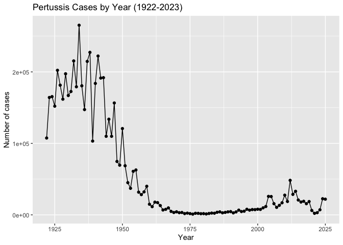
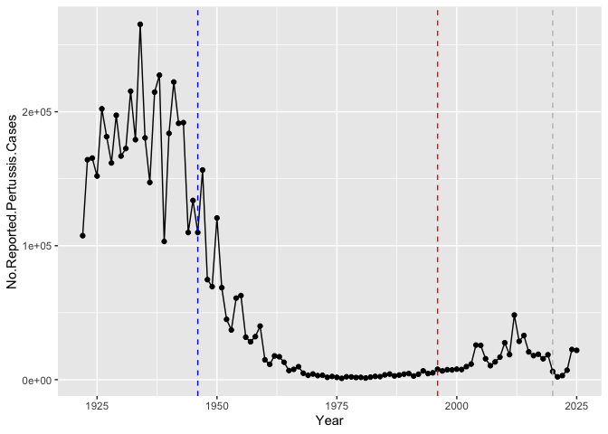
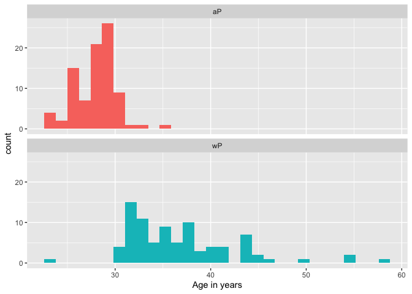
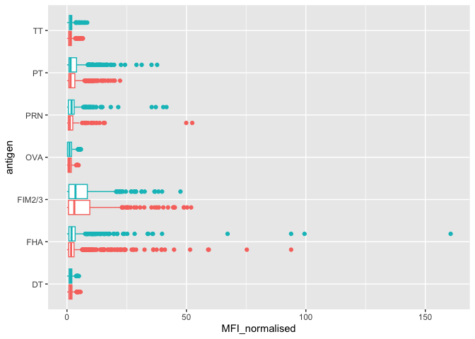
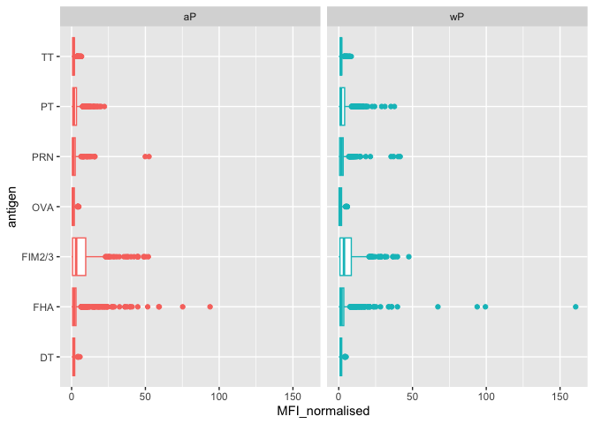
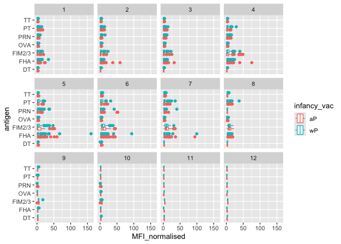
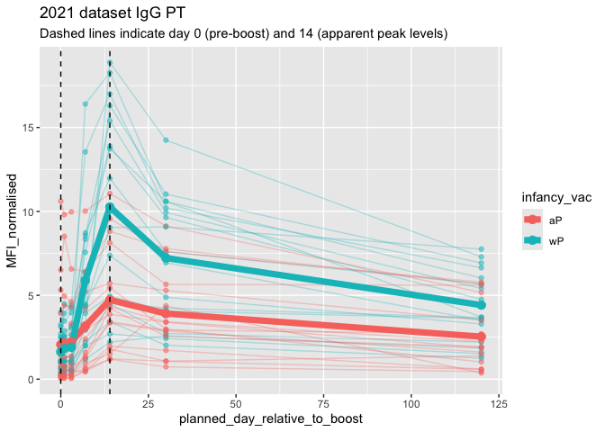

# Class18
Kyle Wittkop (A18592510)

- [Pertussis and the CMI-PB project](#pertussis-and-the-cmi-pb-project)
- [Backround](#backround)
- [1. Investigating pertussis cases by
  year](#investigating-pertussis-cases-by-year)
- [2. A tale of two vaccines (wP & aP)](#a-tale-of-two-vaccines-wp-ap)
- [3. Exploring CMI-PB data](#exploring-cmi-pb-data)
- [Side-Note: Working with dates](#side-note-working-with-dates)
- [Joining multiple tables](#joining-multiple-tables)
- [4. Examine IgG Ab titer levels](#examine-igg-ab-titer-levels)

## Pertussis and the CMI-PB project

## Backround

Pertussis (more commonly known as whooping cough) is a highly contagious
respiratory disease caused by the bacterium Bordetella pertussis (Figure
1). People of all ages can be infected leading to violent coughing fits
followed by a characteristic high-pitched “whoop” like intake of breath.

## 1. Investigating pertussis cases by year

> Q1. With the help of the R “addin” package datapasta assign the CDC
> pertussis case number data to a data frame called cdc and use ggplot
> to make a plot of cases numbers over time.

I want a plot of year on the x axis and cases on the y axis

``` r
library(ggplot2)

ggplot(cdc) +
  aes(Year,No.Reported.Pertussis.Cases) +
  geom_point() +
  geom_line() + 
  labs(x="Year", y= "Number of cases", title = "Pertussis Cases by Year (1922-2023)")
```



## 2. A tale of two vaccines (wP & aP)

> Q2. Using the ggplot geom_vline() function add lines to your previous
> plot for the 1946 introduction of the wP vaccine and the 1996 switch
> to aP vaccine (see example in the hint below). What do you notice?

``` r
ggplot(cdc) +
  aes(Year,No.Reported.Pertussis.Cases) +
  geom_point() +
  geom_line() + 
  geom_vline(xintercept=1946, col="blue", lty=2) + 
  geom_vline(xintercept=1996,col="red", lty=2) + 
  geom_vline(xintercept = 2020, col="gray", lty=2)
```



``` r
  labs(x="Year", y= "Number of cases", title = "Pertussis Cases by Year (1922-2023)")
```

    <ggplot2::labels> List of 3
     $ x    : chr "Year"
     $ y    : chr "Number of cases"
     $ title: chr "Pertussis Cases by Year (1922-2023)"

> Q3. Describe what happened after the introduction of the aP vaccine?
> Do you have a possible explanation for the observed trend?

aP is shown in plot as the red verticle line. After the introduction of
aP, there is an initial period where infections levels seem to remain
the same. After around 2022 we can see that there was a large resurgence
in the number of cases. A possible explanation of this could be bacteria
evolving to evade immunization against the vaccine or it could be caused
by less people getting vaccinated causing the resurgence.

the aP vaccine shows waning efficacy where it reduces immunization for
about a 10 year period before the efficacy of the vaccine falls off.

## 3. Exploring CMI-PB data

``` r
library(jsonlite)
subject <- read_json("https://www.cmi-pb.org/api/subject", simplifyVector = TRUE) 
head(subject, 3)
```

      subject_id infancy_vac biological_sex              ethnicity  race
    1          1          wP         Female Not Hispanic or Latino White
    2          2          wP         Female Not Hispanic or Latino White
    3          3          wP         Female                Unknown White
      year_of_birth date_of_boost      dataset
    1    1986-01-01    2016-09-12 2020_dataset
    2    1968-01-01    2019-01-28 2020_dataset
    3    1983-01-01    2016-10-10 2020_dataset

> Q4. How many aP and wP infancy vaccinated subjects are in the dataset?

``` r
table(subject$infancy_vac)
```


    aP wP 
    87 85 

there are 87 qP infancy vaccination subjects there are 85 wP infancy
vaccination subjects

> Q5. How many Male and Female subjects/patients are in the dataset?

``` r
table(subject$biological_sex)
```


    Female   Male 
       112     60 

There are 112 Females and 60 Males

> Q6. What is the breakdown of race and biological sex (e.g. number of
> Asian females, White males etc…)?

``` r
table(subject$race,subject$biological_sex)
```

                                               
                                                Female Male
      American Indian/Alaska Native                  0    1
      Asian                                         32   12
      Black or African American                      2    3
      More Than One Race                            15    4
      Native Hawaiian or Other Pacific Islander      1    1
      Unknown or Not Reported                       14    7
      White                                         48   32

32 Asian females, 12 Asian males 2 African American Females, 3 African
American Males 1 Alaska Native 15 Females apart of more than one race, 4
males apart of more than one race 1 Pacific islander female, 1 pacific
islander male 14 unknown females, 7 unknown males 48 white females, 32
white males

> Q. is this representative of the US population?

No, there is not enough diversity in the sample to be representative of
the US population.

## Side-Note: Working with dates

``` r
library(lubridate)
```


    Attaching package: 'lubridate'

    The following objects are masked from 'package:base':

        date, intersect, setdiff, union

``` r
# What is today’s date
today()
```

    [1] "2026-03-12"

``` r
# How many days have passed since new year 2000
today() - ymd("2000-01-01")
```

    Time difference of 9567 days

``` r
# What is this in years?
time_length( today() - ymd("2000-01-01"),  "years")
```

    [1] 26.19302

> Q7. Using this approach determine (i) the average age of wP
> individuals, (ii) the average age of aP individuals; and (iii) are
> they significantly different?

``` r
# Use todays date to calculate age in days
subject$age <- today() - ymd(subject$year_of_birth)
```

1)  the average age of wP

``` r
library(dplyr)
```


    Attaching package: 'dplyr'

    The following objects are masked from 'package:stats':

        filter, lag

    The following objects are masked from 'package:base':

        intersect, setdiff, setequal, union

``` r
wp <- subject %>% filter(infancy_vac == "wP")

round( summary( time_length( wp$age, "years" ) ) )
```

       Min. 1st Qu.  Median    Mean 3rd Qu.    Max. 
         23      33      35      37      40      58 

The average Age of wP individuals is 37 years old

(ii)the average age of aP individuals

``` r
ap <- subject %>% filter(infancy_vac == "aP")

round( summary( time_length( ap$age, "years" ) ) )
```

       Min. 1st Qu.  Median    Mean 3rd Qu.    Max. 
         23      27      28      28      29      35 

The average Age of aP individuals is 28 years old

3)  are they significantly different?

``` r
x <- t.test(time_length( wp$age, "years" ),
       time_length( ap$age, "years" ))

x$p.value
```

    [1] 2.372101e-23

p value \< 0.05

both p values are less than 0.05 meaning the two groups are stastically
signifigant

> Q8. Determine the age of all individuals at time of boost?

``` r
int <- ymd(subject$date_of_boost) - ymd(subject$year_of_birth)
age_at_boost <- time_length(int, "year")
head(age_at_boost)
```

    [1] 30.69678 51.07461 33.77413 28.65982 25.65914 28.77481

> Q9. With the help of a faceted boxplot or histogram (see below), do
> you think these two groups are significantly different?

``` r
ggplot(subject) +
  aes(time_length(age, "year"),
      fill=as.factor(infancy_vac)) +
  geom_histogram(show.legend=FALSE) +
  facet_wrap(vars(infancy_vac), nrow=2) +
  xlab("Age in years")
```

    `stat_bin()` using `bins = 30`. Pick better value `binwidth`.



based on the histogram we can clearly see the groups are different

## Joining multiple tables

``` r
Specimen <- read_json("http://cmi-pb.org/api/v5_1/specimen", simplifyVector = T)
ab_titer <- read_json("http://cmi-pb.org/api/v5_1/plasma_ab_titer", simplifyVector = T)
```

``` r
head(Specimen)
```

      specimen_id subject_id actual_day_relative_to_boost
    1           1          1                           -3
    2           2          1                            1
    3           3          1                            3
    4           4          1                            7
    5           5          1                           11
    6           6          1                           32
      planned_day_relative_to_boost specimen_type visit
    1                             0         Blood     1
    2                             1         Blood     2
    3                             3         Blood     3
    4                             7         Blood     4
    5                            14         Blood     5
    6                            30         Blood     6

``` r
head(ab_titer)
```

      specimen_id isotype is_antigen_specific antigen        MFI MFI_normalised
    1           1     IgE               FALSE   Total 1110.21154       2.493425
    2           1     IgE               FALSE   Total 2708.91616       2.493425
    3           1     IgG                TRUE      PT   68.56614       3.736992
    4           1     IgG                TRUE     PRN  332.12718       2.602350
    5           1     IgG                TRUE     FHA 1887.12263      34.050956
    6           1     IgE                TRUE     ACT    0.10000       1.000000
       unit lower_limit_of_detection
    1 UG/ML                 2.096133
    2 IU/ML                29.170000
    3 IU/ML                 0.530000
    4 IU/ML                 6.205949
    5 IU/ML                 4.679535
    6 IU/ML                 2.816431

To make sense of all this data we need to join (aka merge) all these
together, only then will we know that a given aP measurement was
collected on a certain data from a certain wP or aP subject

we can use dplyr and the `*_join()` family of functions to do this

> Q9. Complete the code to join specimen and subject tables to make a
> new merged data frame containing all specimen records along with their
> associated subject details:

``` r
meta <- inner_join(Specimen,subject)
```

    Joining with `by = join_by(subject_id)`

``` r
head(meta)
```

      specimen_id subject_id actual_day_relative_to_boost
    1           1          1                           -3
    2           2          1                            1
    3           3          1                            3
    4           4          1                            7
    5           5          1                           11
    6           6          1                           32
      planned_day_relative_to_boost specimen_type visit infancy_vac biological_sex
    1                             0         Blood     1          wP         Female
    2                             1         Blood     2          wP         Female
    3                             3         Blood     3          wP         Female
    4                             7         Blood     4          wP         Female
    5                            14         Blood     5          wP         Female
    6                            30         Blood     6          wP         Female
                   ethnicity  race year_of_birth date_of_boost      dataset
    1 Not Hispanic or Latino White    1986-01-01    2016-09-12 2020_dataset
    2 Not Hispanic or Latino White    1986-01-01    2016-09-12 2020_dataset
    3 Not Hispanic or Latino White    1986-01-01    2016-09-12 2020_dataset
    4 Not Hispanic or Latino White    1986-01-01    2016-09-12 2020_dataset
    5 Not Hispanic or Latino White    1986-01-01    2016-09-12 2020_dataset
    6 Not Hispanic or Latino White    1986-01-01    2016-09-12 2020_dataset
             age
    1 14680 days
    2 14680 days
    3 14680 days
    4 14680 days
    5 14680 days
    6 14680 days

lets do one more inner join, to join the ab_titer (antibody
measurements) with the meta data we just created.

> Q10. Now using the same procedure join meta with titer data so we can
> further analyze this data in terms of time of visit aP/wP, male/female
> etc.

``` r
abdata <- inner_join(ab_titer, meta)
```

    Joining with `by = join_by(specimen_id)`

``` r
head(abdata)
```

      specimen_id isotype is_antigen_specific antigen        MFI MFI_normalised
    1           1     IgE               FALSE   Total 1110.21154       2.493425
    2           1     IgE               FALSE   Total 2708.91616       2.493425
    3           1     IgG                TRUE      PT   68.56614       3.736992
    4           1     IgG                TRUE     PRN  332.12718       2.602350
    5           1     IgG                TRUE     FHA 1887.12263      34.050956
    6           1     IgE                TRUE     ACT    0.10000       1.000000
       unit lower_limit_of_detection subject_id actual_day_relative_to_boost
    1 UG/ML                 2.096133          1                           -3
    2 IU/ML                29.170000          1                           -3
    3 IU/ML                 0.530000          1                           -3
    4 IU/ML                 6.205949          1                           -3
    5 IU/ML                 4.679535          1                           -3
    6 IU/ML                 2.816431          1                           -3
      planned_day_relative_to_boost specimen_type visit infancy_vac biological_sex
    1                             0         Blood     1          wP         Female
    2                             0         Blood     1          wP         Female
    3                             0         Blood     1          wP         Female
    4                             0         Blood     1          wP         Female
    5                             0         Blood     1          wP         Female
    6                             0         Blood     1          wP         Female
                   ethnicity  race year_of_birth date_of_boost      dataset
    1 Not Hispanic or Latino White    1986-01-01    2016-09-12 2020_dataset
    2 Not Hispanic or Latino White    1986-01-01    2016-09-12 2020_dataset
    3 Not Hispanic or Latino White    1986-01-01    2016-09-12 2020_dataset
    4 Not Hispanic or Latino White    1986-01-01    2016-09-12 2020_dataset
    5 Not Hispanic or Latino White    1986-01-01    2016-09-12 2020_dataset
    6 Not Hispanic or Latino White    1986-01-01    2016-09-12 2020_dataset
             age
    1 14680 days
    2 14680 days
    3 14680 days
    4 14680 days
    5 14680 days
    6 14680 days

> Q11. How many specimens (i.e. entries in abdata) do we have for each
> isotype?

``` r
table(abdata$isotype)
```


      IgE   IgG  IgG1  IgG2  IgG3  IgG4 
     6698  7265 11993 12000 12000 12000 

IgE IgG IgG1 IgG2 IgG3 IgG4 6698 7265 11993 12000 12000 12000

lookig at antigens in the data set :

``` r
table(abdata$antigen)
```


        ACT   BETV1      DT   FELD1     FHA  FIM2/3   LOLP1     LOS Measles     OVA 
       1970    1970    6318    1970    6712    6318    1970    1970    1970    6318 
        PD1     PRN      PT     PTM   Total      TT 
       1970    6712    6712    1970     788    6318 

> Q12. What are the different \$dataset values in abdata and what do you
> notice about the number of rows for the most “recent” dataset?

``` r
table(abdata$dataset) 
```


    2020_dataset 2021_dataset 2022_dataset 2023_dataset 
           31520         8085         7301        15050 

There are 4 number of data set values in abdata. I notice that the
number of rows for the most recent data sets is not the largest and is
much smaller for the 2020 data sets, suggesting the number of samples
collected declined substantially between years.

## 4. Examine IgG Ab titer levels

``` r
igg <- abdata %>% filter(isotype == "IgG")
head(igg)
```

      specimen_id isotype is_antigen_specific antigen        MFI MFI_normalised
    1           1     IgG                TRUE      PT   68.56614       3.736992
    2           1     IgG                TRUE     PRN  332.12718       2.602350
    3           1     IgG                TRUE     FHA 1887.12263      34.050956
    4          19     IgG                TRUE      PT   20.11607       1.096366
    5          19     IgG                TRUE     PRN  976.67419       7.652635
    6          19     IgG                TRUE     FHA   60.76626       1.096457
       unit lower_limit_of_detection subject_id actual_day_relative_to_boost
    1 IU/ML                 0.530000          1                           -3
    2 IU/ML                 6.205949          1                           -3
    3 IU/ML                 4.679535          1                           -3
    4 IU/ML                 0.530000          3                           -3
    5 IU/ML                 6.205949          3                           -3
    6 IU/ML                 4.679535          3                           -3
      planned_day_relative_to_boost specimen_type visit infancy_vac biological_sex
    1                             0         Blood     1          wP         Female
    2                             0         Blood     1          wP         Female
    3                             0         Blood     1          wP         Female
    4                             0         Blood     1          wP         Female
    5                             0         Blood     1          wP         Female
    6                             0         Blood     1          wP         Female
                   ethnicity  race year_of_birth date_of_boost      dataset
    1 Not Hispanic or Latino White    1986-01-01    2016-09-12 2020_dataset
    2 Not Hispanic or Latino White    1986-01-01    2016-09-12 2020_dataset
    3 Not Hispanic or Latino White    1986-01-01    2016-09-12 2020_dataset
    4                Unknown White    1983-01-01    2016-10-10 2020_dataset
    5                Unknown White    1983-01-01    2016-10-10 2020_dataset
    6                Unknown White    1983-01-01    2016-10-10 2020_dataset
             age
    1 14680 days
    2 14680 days
    3 14680 days
    4 15776 days
    5 15776 days
    6 15776 days

``` r
ggplot(igg) +
  aes(MFI_normalised, antigen) +
  geom_boxplot() 
```


> Q14. What antigens show differences in the level of IgG antibody
> titers recognizing them over time? Why these and not others?

FIM2/3, FHA, PT, PRN show the largest difference in level of IgG
antibody titers recognized overtime. This is because these are the
components of the aP vaccine.

Others like DT,OVA,TT are not components of the aP vaccine and we
wouldnt expect them to show any difference. for example DT is an
antibody for measles, we would not expect the subjects to be producing
the antibodies for measles in this data resulting in no antigen
difference in level of IgG.

> Q. is there a difference in these responses between aP and wP
> individuals?

``` r
ggplot(igg) +
  aes(MFI_normalised, antigen, col=infancy_vac ) +
  geom_boxplot(show.legend = FALSE) 
```



Here we can examine differences between wP and aP here by setting color
to include infancy_vac status.

we can also use faceting :

``` r
ggplot(igg) +
  aes(MFI_normalised, antigen, col=infancy_vac ) +
  geom_boxplot(show.legend = FALSE) + 
  facet_wrap(~infancy_vac)
```



Is there a difference with time ( a 4 booster shot vs after booster
shot)

``` r
ggplot(igg) +
  aes(MFI_normalised, antigen, col=infancy_vac ) +
  geom_boxplot() + 
  facet_wrap(vars(visit))
```



> Q15. Filter to pull out only two specific antigens for analysis and
> create a boxplot for each. You can chose any you like. Below I picked
> a “control” antigen (“OVA”, that is not in our vaccines) and a clear
> antigen of interest (“PT”, Pertussis Toxin, one of the key virulence
> factors produced by the bacterium B. pertussis).

``` r
abdata.21 <- abdata %>% filter(dataset == "2021_dataset")

abdata.21 %>% 
  filter(isotype == "IgG", antigen == "PT") %>%
  ggplot(aes(x = planned_day_relative_to_boost,
             y = MFI_normalised,
             col = infancy_vac)) +
  geom_point(aes(group = subject_id), alpha = 0.5) +
  geom_line(aes(group = subject_id), alpha = 0.3) +
  stat_summary(aes(group = infancy_vac),
               fun = mean,
               geom = "line",
               linewidth = 2.5) +
  stat_summary(aes(group = infancy_vac),
               fun = mean,
               geom = "point",
               size = 3) +
  geom_vline(xintercept = 0, linetype = "dashed") +
  geom_vline(xintercept = 14, linetype = "dashed") +
  labs(title = "2021 dataset IgG PT",
       subtitle = "Dashed lines indicate day 0 (pre-boost) and 14 (apparent peak levels)")
```



we can see here the first ecidence that something is different from wP
and aP individuals, the peak values are higher in wP and decline slower.
