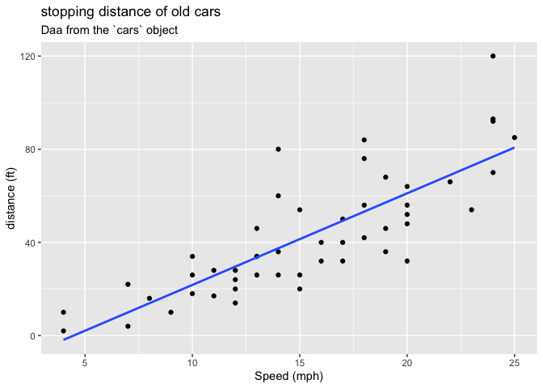
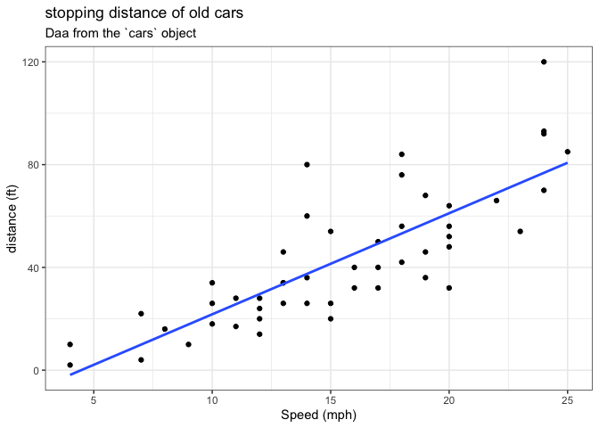
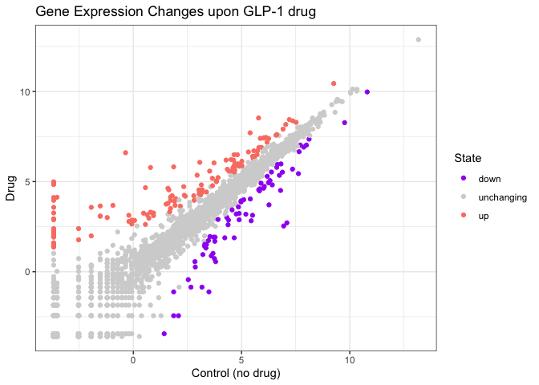
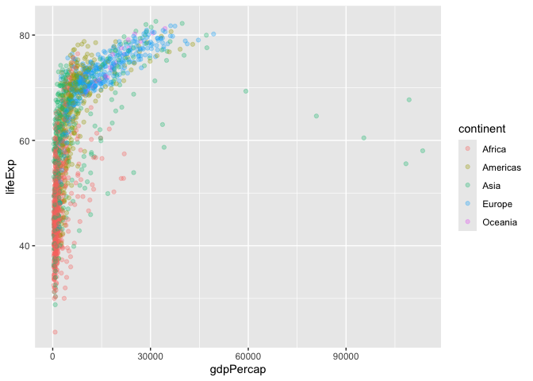
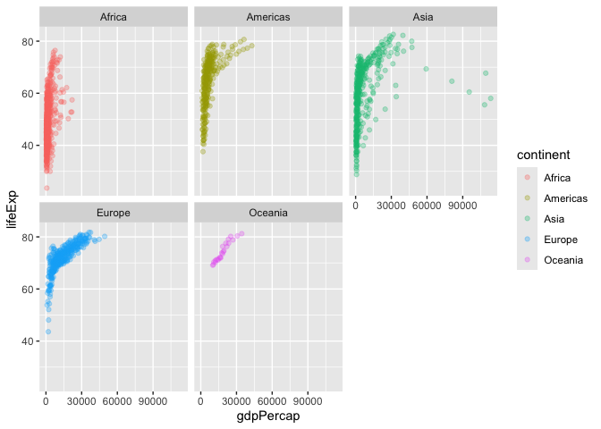

# Class 5 : Data viz with ggplot
Kyle Wittkop (PID: A18592410)

- [Backround](#backround)
- [Gene Expression Plot](#gene-expression-plot)
- [Going further](#going-further)

## Backround

There are lot’s of ways to make figures in R. These include so-called
“Base R” graphics (e.g. `plot()`) and tones of add-on packages like
**ggplot2**.

For example here we make the same plot with both:

``` r
head(cars)
```

      speed dist
    1     4    2
    2     4   10
    3     7    4
    4     7   22
    5     8   16
    6     9   10

``` r
plot(cars)
```


First I need to install the package with the command
‘install.packages()’

> **N.B.** we never run an install cmd in a quarto code chunk or we will
> end up re-installing packages many many times - which is not what we
> want.

Everytime we want to use one of these “add-on” packages we need to load
it up in R with the `library()` function :

``` r
#ggplot(cars)
library(ggplot2)
```

``` r
ggplot(cars)
```


Every ggplot needs at least 3 things :

- The **data**, the stuff you want plotted
- the **aes**thetics, how the data will map to the plot
- the **geom**etry, the type of plot

``` r
ggplot(cars) + 
  aes(x=speed, y=dist) + 
  geom_point() 
```


Add a line to better show relationship between speed and distance

``` r
P <- ggplot(cars) + 
  aes(x=speed, y=dist) + 
  geom_point() + geom_smooth(method="lm", se=FALSE,) + 
  labs(title="stopping distance of old cars",
       subtitle="Daa from the `cars` object", 
       x= "Speed (mph)",
       y= "distance (ft)")
```

render it out

``` r
P
```

    `geom_smooth()` using formula = 'y ~ x'



``` r
P + theme_bw()
```

    `geom_smooth()` using formula = 'y ~ x'



## Gene Expression Plot

We can read the input data from the class website

``` r
url <- "https://bioboot.github.io/bimm143_S20/class-material/up_down_expression.txt"
genes <- read.delim(url)
head(genes)
```

            Gene Condition1 Condition2      State
    1      A4GNT -3.6808610 -3.4401355 unchanging
    2       AAAS  4.5479580  4.3864126 unchanging
    3      AASDH  3.7190695  3.4787276 unchanging
    4       AATF  5.0784720  5.0151916 unchanging
    5       AATK  0.4711421  0.5598642 unchanging
    6 AB015752.4 -3.6808610 -3.5921390 unchanging

A first version plot

``` r
ggplot(genes) + 
  aes(Condition1, Condition2) + 
  geom_point()
```


``` r
table (genes$State) 
```


          down unchanging         up 
            72       4997        127 

Version 2 let’s color by ‘State’ so we can see the up and down
signifigant genes copares to all of the unchanging genes

``` r
ggplot(genes) + 
  aes(Condition1, Condition2, col=State) + 
  geom_point()
```


Version 3 plot, lets modify the defualt colors to something we like

``` r
ggplot(genes) + 
  aes(Condition1, Condition2, col=State) + 
  geom_point() + 
  scale_color_manual(values=c("purple","lightgrey","salmon")) +
  labs(x="Control (no drug)",
       y="Drug", 
        title = "Gene Expression Changes upon GLP-1 drug") + 
  theme_bw()
```



## Going further

lets have a look at the famous

``` r
url <- "https://raw.githubusercontent.com/jennybc/gapminder/master/inst/extdata/gapminder.tsv"

gapminder <- read.delim(url)
```

``` r
head(gapminder, 6)
```

          country continent year lifeExp      pop gdpPercap
    1 Afghanistan      Asia 1952  28.801  8425333  779.4453
    2 Afghanistan      Asia 1957  30.332  9240934  820.8530
    3 Afghanistan      Asia 1962  31.997 10267083  853.1007
    4 Afghanistan      Asia 1967  34.020 11537966  836.1971
    5 Afghanistan      Asia 1972  36.088 13079460  739.9811
    6 Afghanistan      Asia 1977  38.438 14880372  786.1134

``` r
ggplot(gapminder) +
  aes(gdpPercap,lifeExp, col=continent) + 
  geom_point(alpha=0.3) 
```



Lets “facet” (i.e. make a seperate plot) by continent other than the big
hot mess above

``` r
ggplot(gapminder) +
  aes(gdpPercap,lifeExp, col=continent) + 
  geom_point(alpha=0.3) + 
  facet_wrap(~continent) 
```



\##Custom plots How big is this gapminder dataset ()

``` r
nrow(gapminder)
```

    [1] 1704

``` r
library(dplyr)
```


    Attaching package: 'dplyr'

    The following objects are masked from 'package:stats':

        filter, lag

    The following objects are masked from 'package:base':

        intersect, setdiff, setequal, union

we want to “filter” down to a subset of this data. I will use the
**dplyr** package to help me

First I need to install it and then load it up…
`install.packages("dplyr")` and then `library(dplyr)`

``` r
library(dplyr)

 GM2007<- filter(gapminder, year==2007)
 head(GM2007)
```

          country continent year lifeExp      pop  gdpPercap
    1 Afghanistan      Asia 2007  43.828 31889923   974.5803
    2     Albania    Europe 2007  76.423  3600523  5937.0295
    3     Algeria    Africa 2007  72.301 33333216  6223.3675
    4      Angola    Africa 2007  42.731 12420476  4797.2313
    5   Argentina  Americas 2007  75.320 40301927 12779.3796
    6   Australia   Oceania 2007  81.235 20434176 34435.3674

``` r
filter(gapminder, year==2007, country=="Ireland")
```

      country continent year lifeExp     pop gdpPercap
    1 Ireland    Europe 2007  78.885 4109086     40676

``` r
filter(gapminder, year==1977, country=="United States")
```

            country continent year lifeExp       pop gdpPercap
    1 United States  Americas 1977   73.38 220239000  24072.63

> Q. Make a plot comparing 1977 and 2007 for all countries

``` r
comp<-filter(gapminder, year %in% c(1977,2007))
```

``` r
ggplot(gapminder) +
  aes(gdpPercap,lifeExp, col=continent) + 
  geom_point(alpha=1) + 
  facet_wrap(~year) + 
  filter(gapminder, year %in% c(1977,2007))
```


