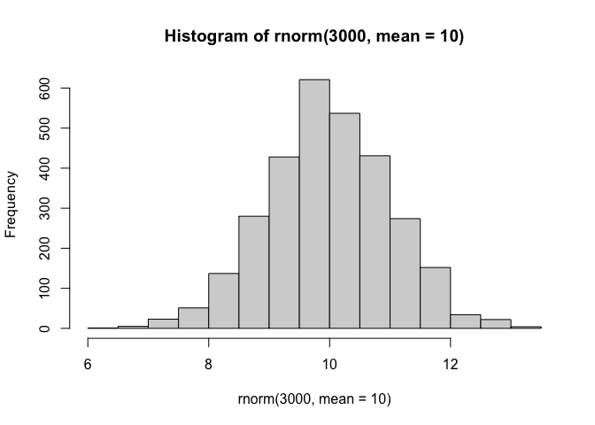
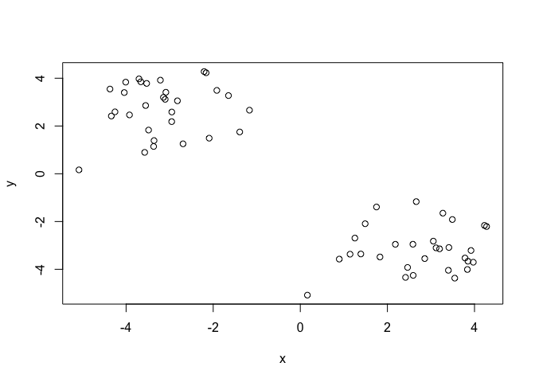
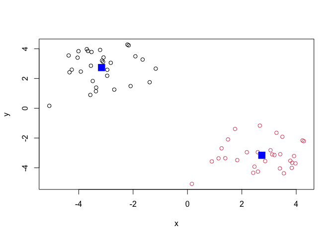
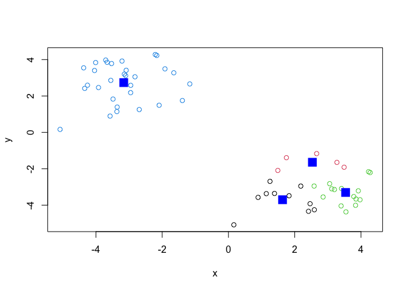
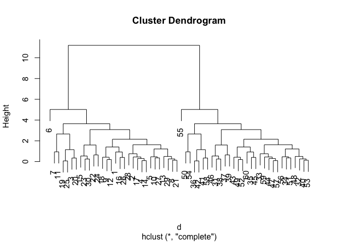
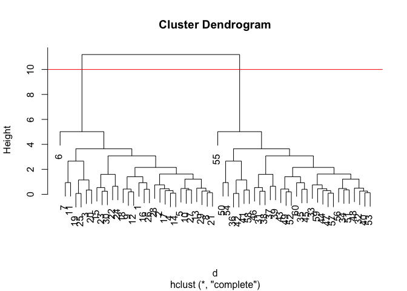
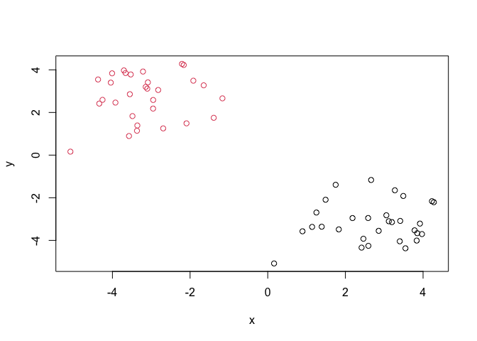
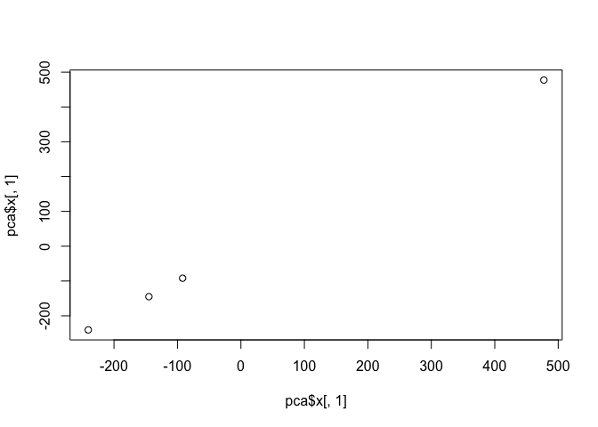
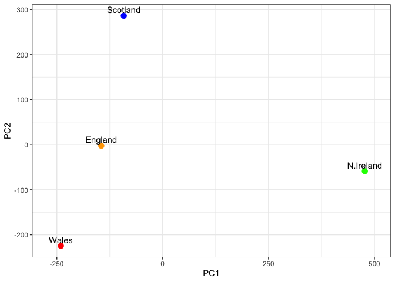

# Class 07 : Machine Learning 1
Kyle Wittkop (A18592410)

- [Backround](#backround)
- [K-means, cluster](#k-means-cluster)
- [Hierarchical clustering](#hierarchical-clustering)
- [Principal component analysis
  (PCA)](#principal-component-analysis-pca)
  - [PCA of UK food data](#pca-of-uk-food-data)
  - [Heatmap](#heatmap)
  - [PCA to the rescue](#pca-to-the-rescue)
- [Digging Deeper - Variable
  loadings](#digging-deeper---variable-loadings)

## Backround

Today we will begin our exploration of important machine learning
methods, as a focus on **clustering** and **dimensionality reduction**.

To start testing these methods, lets make up some sample data dots to
cluster where we know what the answer should be.

``` r
hist(rnorm(3000, mean=10))
```



> Q. Can you generate 30 numbers centered around +3 taken atrandom drom
> a normal distribution

``` r
rnorm(30, mean=3)
```

     [1] 2.6096307 3.2712895 3.4790968 1.0960593 4.1009133 5.6219704 3.9002756
     [8] 3.0498772 1.7287725 4.6808472 3.6523448 3.0592180 3.1670673 3.7465639
    [15] 2.9315277 2.2190806 2.1387739 2.9823532 3.4128957 3.3401877 3.8477274
    [22] 4.1648153 2.2452862 2.2907832 2.7622536 2.4269026 1.9546421 0.5644629
    [29] 2.2450586 3.1272090

``` r
rnorm(30,mean=-3)
```

     [1] -4.1856262 -2.8346696 -2.2717525 -4.0380915 -2.6372964 -3.5855512
     [7] -4.7526536 -3.0959756 -2.6071168 -2.9310805 -3.5985742 -2.9540030
    [13] -2.6680721 -2.9764755 -3.6937553 -1.8936922 -3.7327587 -5.1099432
    [19] -4.8838427 -3.3595809 -2.2405389 -2.0991273 -0.6066235 -2.6845546
    [25] -3.3290233 -3.8846592 -2.1458906 -1.5792902 -3.0824324 -2.6774598

``` r
tmp <- c(rnorm(30, mean=3),
rnorm(30,mean=-3)) 

x <-cbind(x=tmp, y=rev(tmp))

plot(x)
```



## K-means, cluster

The main functon in Base R, for K means clustering is called
`K means()`. Lets try it out.

``` r
k <- kmeans(x, centers = 2)
k
```

    K-means clustering with 2 clusters of sizes 30, 30

    Cluster means:
              x         y
    1 -3.159977  2.734461
    2  2.734461 -3.159977

    Clustering vector:
     [1] 2 2 2 2 2 2 2 2 2 2 2 2 2 2 2 2 2 2 2 2 2 2 2 2 2 2 2 2 2 2 1 1 1 1 1 1 1 1
    [39] 1 1 1 1 1 1 1 1 1 1 1 1 1 1 1 1 1 1 1 1 1 1

    Within cluster sum of squares by cluster:
    [1] 59.83424 59.83424
     (between_SS / total_SS =  89.7 %)

    Available components:

    [1] "cluster"      "centers"      "totss"        "withinss"     "tot.withinss"
    [6] "betweenss"    "size"         "iter"         "ifault"      

> Q. What component of your result object has the cluster centers

``` r
k$centers
```

              x         y
    1 -3.159977  2.734461
    2  2.734461 -3.159977

> Q. What component of your result object has the cluster size

``` r
k$size
```

    [1] 30 30

> Q. What component of your result object has the cluster membership
> vector (i.e the main clustering result: which poins are in which
> cluster )

``` r
k$cluster
```

     [1] 2 2 2 2 2 2 2 2 2 2 2 2 2 2 2 2 2 2 2 2 2 2 2 2 2 2 2 2 2 2 1 1 1 1 1 1 1 1
    [39] 1 1 1 1 1 1 1 1 1 1 1 1 1 1 1 1 1 1 1 1 1 1

> Q. Plot the result of cluster (i.e)

``` r
plot(x, col= k$cluster)
points(k$centers, col = "blue", pch=15, cex=2)
```



> Q. Can you run k means again and cluster into 4 groups and plot the
> results

``` r
k <- kmeans(x, centers = 4)
k
```

    K-means clustering with 4 clusters of sizes 10, 5, 15, 30

    Cluster means:
              x         y
    1  1.632820 -3.702814
    2  2.533248 -1.643252
    3  3.535959 -3.303661
    4 -3.159977  2.734461

    Clustering vector:
     [1] 1 3 2 3 3 1 2 3 1 3 2 1 3 3 1 3 3 1 3 2 3 1 1 2 3 1 3 3 3 1 4 4 4 4 4 4 4 4
    [39] 4 4 4 4 4 4 4 4 4 4 4 4 4 4 4 4 4 4 4 4 4 4

    Within cluster sum of squares by cluster:
    [1] 10.252543  3.752621  9.095839 59.834238
     (between_SS / total_SS =  92.9 %)

    Available components:

    [1] "cluster"      "centers"      "totss"        "withinss"     "tot.withinss"
    [6] "betweenss"    "size"         "iter"         "ifault"      

``` r
plot(x, col= k$cluster)
points(k$centers, col = "blue", pch=15, cex=2)
```



> **Key point** K-means will always return clustering that we ask for,
> this is the k or `centers` in K means.

``` r
k$tot.withinss
```

    [1] 82.93524

## Hierarchical clustering

The main function to do this in base R is called hclust `hclust()`. One
of the main differences with respect to the k means function, is that
you cannot put your input data directly. it needs a distance matrix or a
dissimilarity matrix. we can get this from lots of places including the
dist function,

``` r
d <- dist(x) 
hc <- hclust(d)
plot(hc)
```



We can cut the deprogram, at a given height to yield our clusters

``` r
plot(hc)
abline(h=10,col="red")
```



``` r
grps<-cutree(hc, h=10)
```

``` r
grps
```

     [1] 1 1 1 1 1 1 1 1 1 1 1 1 1 1 1 1 1 1 1 1 1 1 1 1 1 1 1 1 1 1 2 2 2 2 2 2 2 2
    [39] 2 2 2 2 2 2 2 2 2 2 2 2 2 2 2 2 2 2 2 2 2 2

> Q, Plot out data ‘x’ clored by clustering resulting from hclust (),
> and cutree

``` r
plot(x, col=grps)
```



## Principal component analysis (PCA)

PCA is a popular nationality reduction technique thats widly used in
bioinformatics

### PCA of UK food data

> Q1. How many rows and columns are in your new data frame named x? What
> R functions could you use to answer this questions?

``` r
url <- "https://tinyurl.com/UK-foods"
x <- read.csv(url)
dim(x)
```

    [1] 17  5

It looks like the row names were not set properly. We can fix this.

``` r
rownames(x) <- x[,1]
x <- x[,-1]
x
```

                        England Wales Scotland N.Ireland
    Cheese                  105   103      103        66
    Carcass_meat            245   227      242       267
    Other_meat              685   803      750       586
    Fish                    147   160      122        93
    Fats_and_oils           193   235      184       209
    Sugars                  156   175      147       139
    Fresh_potatoes          720   874      566      1033
    Fresh_Veg               253   265      171       143
    Other_Veg               488   570      418       355
    Processed_potatoes      198   203      220       187
    Processed_Veg           360   365      337       334
    Fresh_fruit            1102  1137      957       674
    Cereals                1472  1582     1462      1494
    Beverages                57    73       53        47
    Soft_drinks            1374  1256     1572      1506
    Alcoholic_drinks        375   475      458       135
    Confectionery            54    64       62        41

A Better way to do this is to fix the row names assignment at import
times :

``` r
x <-read.csv(url, row.names = 1)
x 
```

                        England Wales Scotland N.Ireland
    Cheese                  105   103      103        66
    Carcass_meat            245   227      242       267
    Other_meat              685   803      750       586
    Fish                    147   160      122        93
    Fats_and_oils           193   235      184       209
    Sugars                  156   175      147       139
    Fresh_potatoes          720   874      566      1033
    Fresh_Veg               253   265      171       143
    Other_Veg               488   570      418       355
    Processed_potatoes      198   203      220       187
    Processed_Veg           360   365      337       334
    Fresh_fruit            1102  1137      957       674
    Cereals                1472  1582     1462      1494
    Beverages                57    73       53        47
    Soft_drinks            1374  1256     1572      1506
    Alcoholic_drinks        375   475      458       135
    Confectionery            54    64       62        41

> Q3: Changing what optional argument in the above barplot() function
> results in the following plot?

``` r
barplot(as.matrix(x), beside=T, col=rainbow(nrow(x)))
```


``` r
barplot(as.matrix(x), beside=F, col=rainbow(nrow(x)))
```


> Q5: We can use the pairs() function to generate all pairwise plots for
> our countries. Can you make sense of the following code and resulting
> figure? What does it mean if a given point lies on the diagonal for a
> given plot?

``` r
pairs(x, col=rainbow(nrow(x)), pch=16)
```


each point represents the data surrounding a food consumed by the 4
countries. If a given point lies on the diagonal for a given plot, it
showed that the point is shared in value between the two countries
plotted against each other. If it is off the diagonal, it means there is
different values for these foods in these two countries.

### Heatmap

we can install the ***pheatmap*** package with the install.packages
command that we used the previously. Remember that we always run this in
console and not a code chunk in our quarto document

``` r
library(pheatmap)

pheatmap( as.matrix(x) )
```


> Q6. Based on the pairs and heatmap figures, which countries cluster
> together and what does this suggest about their food consumption
> patterns? Can you easily tell what the main differences between N.
> Ireland and the other countries of the UK in terms of this data-set?

Based on the pairs and heat map figures, it appear that England, Wales,
and Scotland cluster together suggesting their food consumption patterns
are similar. We can fairly easily tell the different between Ireland and
the other countries, however the pairs shows this difference more
effectively as seen in the disorder of points along the diagonal when
comparing to the other countries.

Of all these plots, really only the pairs plot was useful. This however
took a bit of work to interpretative and will not scale when looking at
much bigger data sets.

### PCA to the rescue

The main function in “base R” for PCA is called `prcomp()`

``` r
pca <- prcomp ( t(x) ) 
summary(pca)
```

    Importance of components:
                                PC1      PC2      PC3     PC4
    Standard deviation     324.1502 212.7478 73.87622 2.7e-14
    Proportion of Variance   0.6744   0.2905  0.03503 0.0e+00
    Cumulative Proportion    0.6744   0.9650  1.00000 1.0e+00

> Q. How much variance is captured in the first PC?

67.44% of variance is captured in the first PC

> Q. How many PCs do I need to capture to acheive at least 90% of the
> total cariance in the data set?

We need to capture 2 PCs in order to achieve a 96.5% of variance shown
in cumulative proportions.

> Q Plot out main PCA results Folks can call this different things
> depending on their field of study for example PC plot.

``` r
attributes(pca)
```

    $names
    [1] "sdev"     "rotation" "center"   "scale"    "x"       

    $class
    [1] "prcomp"

To generate our plot we want psa\$x

``` r
pca$x
```

                     PC1         PC2        PC3           PC4
    England   -144.99315   -2.532999 105.768945  1.612425e-14
    Wales     -240.52915 -224.646925 -56.475555  4.751043e-13
    Scotland   -91.86934  286.081786 -44.415495 -6.044349e-13
    N.Ireland  477.39164  -58.901862  -4.877895  1.145386e-13

``` r
my_cols <- c("orange","red","blue","green")
plot(pca$x [,1], pca$x [,1]) 
```



``` r
library(ggplot2)
ggplot(pca$x) +
  aes(x = PC1, y = PC2, label = rownames(pca$x)) +
  geom_point(size = 3, col=my_cols) +
  geom_text(vjust = -0.5) +
  xlim(-270, 500) +
  xlab("PC1") +
  ylab("PC2") +
  theme_bw()
```



## Digging Deeper - Variable loadings

How do the original variables (17 different foods) contribute to our new
PCS?

``` r
ggplot(pca$rotation) +
  aes(x = PC1, 
      y = reorder(rownames(pca$rotation), PC1)) +
  geom_col(fill = "steelblue") +
  xlab("PC1 Loading Score") +
  ylab("") +
  theme_bw() +
  theme(axis.text.y = element_text(size = 9))
```


