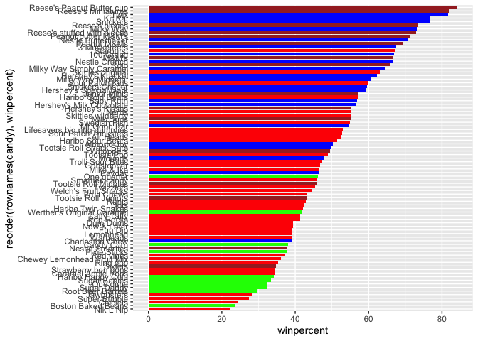
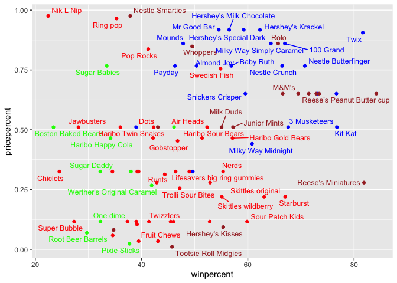
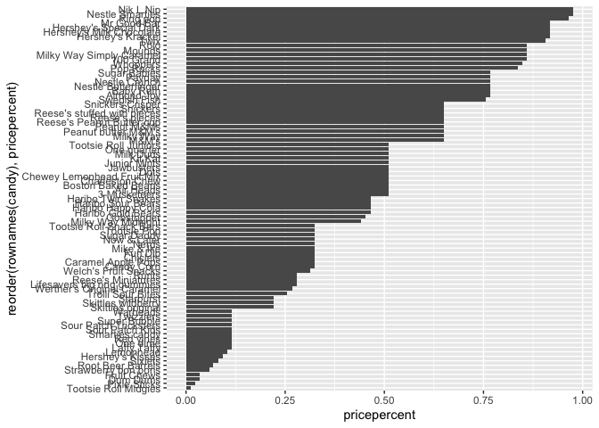
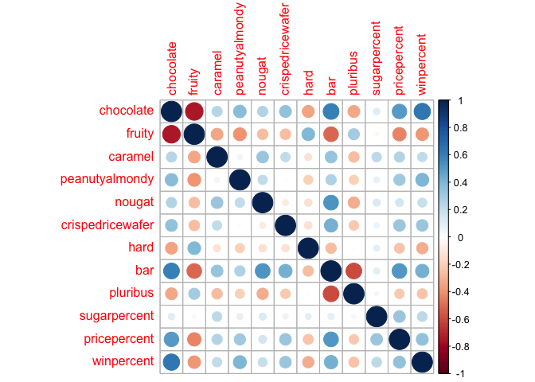
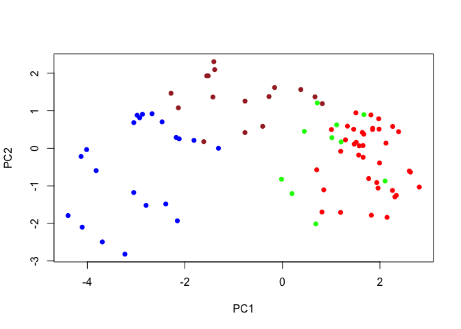
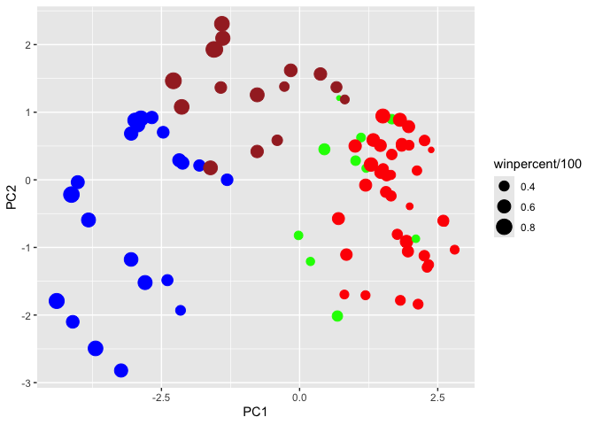
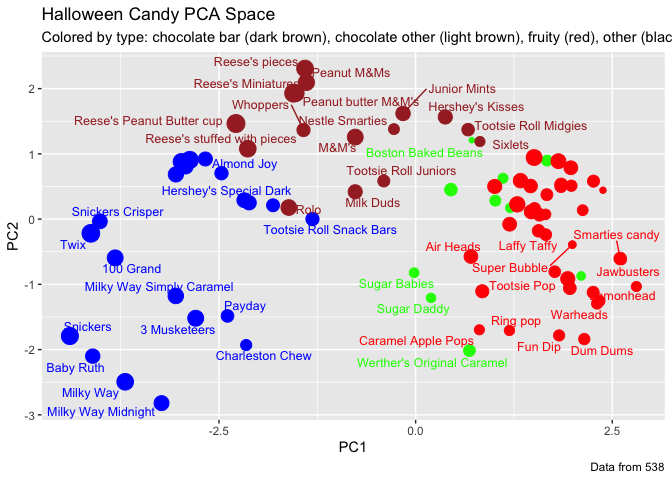
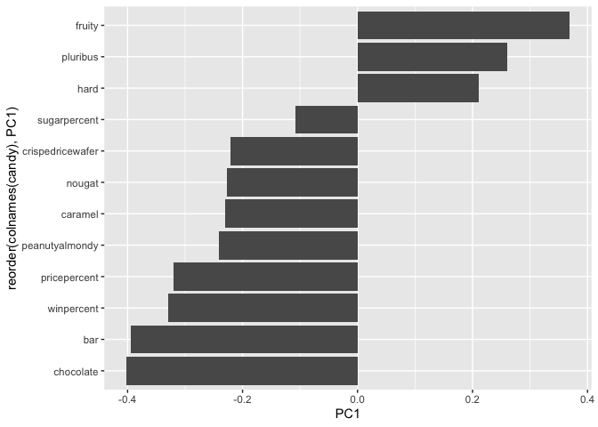

# Class09 - Candy Project
Kyle Wittkop (A18592410)

- [Importing candy data](#importing-candy-data)
- [Exploratory analysis](#exploratory-analysis)
- [Overall Candy Rankings](#overall-candy-rankings)
- [6 Exploring the coorelation
  structure](#exploring-the-coorelation-structure)
- [Principal Component Analysis](#principal-component-analysis)
- [Summary](#summary)
- [Optional extension questions](#optional-extension-questions)

## Importing candy data

``` r
candy_file <- "candy-data.csv"

candy = read.csv(candy_file, row.names=1)
head(candy)
```

                 chocolate fruity caramel peanutyalmondy nougat crispedricewafer
    100 Grand            1      0       1              0      0                1
    3 Musketeers         1      0       0              0      1                0
    One dime             0      0       0              0      0                0
    One quarter          0      0       0              0      0                0
    Air Heads            0      1       0              0      0                0
    Almond Joy           1      0       0              1      0                0
                 hard bar pluribus sugarpercent pricepercent winpercent
    100 Grand       0   1        0        0.732        0.860   66.97173
    3 Musketeers    0   1        0        0.604        0.511   67.60294
    One dime        0   0        0        0.011        0.116   32.26109
    One quarter     0   0        0        0.011        0.511   46.11650
    Air Heads       0   0        0        0.906        0.511   52.34146
    Almond Joy      0   1        0        0.465        0.767   50.34755

``` r
nrow(candy)
```

    [1] 85

``` r
sum(candy$fruity)
```

    [1] 38

> Q1. How many different candy types are in this dataset?

85

> Q2. How many fruity candy types are in the dataset?

38

``` r
library(dplyr)
```


    Attaching package: 'dplyr'

    The following objects are masked from 'package:stats':

        filter, lag

    The following objects are masked from 'package:base':

        intersect, setdiff, setequal, union

``` r
candy %>%
  filter(row.names(candy)=="Twix") %>%
  select(winpercent)
```

         winpercent
    Twix   81.64291

``` r
candy["Twix", ]$winpercent
```

    [1] 81.64291

> Q3. What is your favorite candy (other than Twix) in the dataset and
> what is it’s winpercent value?

``` r
candy["Air Heads", ]$winpercent
```

    [1] 52.34146

Air Head win percent = 52.34146

> Q4. What is the winpercent value for “Kit Kat”?

``` r
candy["Kit Kat", ]$winpercent
```

    [1] 76.7686

76.7686

> Q5. What is the winpercent value for “Tootsie Roll Snack Bars”?

``` r
candy["Tootsie Roll Snack Bars", ]$winpercent
```

    [1] 49.6535

49.6535

``` r
library("skimr")
skim(candy)
```

|                                                  |       |
|:-------------------------------------------------|:------|
| Name                                             | candy |
| Number of rows                                   | 85    |
| Number of columns                                | 12    |
| \_\_\_\_\_\_\_\_\_\_\_\_\_\_\_\_\_\_\_\_\_\_\_   |       |
| Column type frequency:                           |       |
| numeric                                          | 12    |
| \_\_\_\_\_\_\_\_\_\_\_\_\_\_\_\_\_\_\_\_\_\_\_\_ |       |
| Group variables                                  | None  |

Data summary

**Variable type: numeric**

| skim_variable | n_missing | complete_rate | mean | sd | p0 | p25 | p50 | p75 | p100 | hist |
|:---|---:|---:|---:|---:|---:|---:|---:|---:|---:|:---|
| chocolate | 0 | 1 | 0.44 | 0.50 | 0.00 | 0.00 | 0.00 | 1.00 | 1.00 | ▇▁▁▁▆ |
| fruity | 0 | 1 | 0.45 | 0.50 | 0.00 | 0.00 | 0.00 | 1.00 | 1.00 | ▇▁▁▁▆ |
| caramel | 0 | 1 | 0.16 | 0.37 | 0.00 | 0.00 | 0.00 | 0.00 | 1.00 | ▇▁▁▁▂ |
| peanutyalmondy | 0 | 1 | 0.16 | 0.37 | 0.00 | 0.00 | 0.00 | 0.00 | 1.00 | ▇▁▁▁▂ |
| nougat | 0 | 1 | 0.08 | 0.28 | 0.00 | 0.00 | 0.00 | 0.00 | 1.00 | ▇▁▁▁▁ |
| crispedricewafer | 0 | 1 | 0.08 | 0.28 | 0.00 | 0.00 | 0.00 | 0.00 | 1.00 | ▇▁▁▁▁ |
| hard | 0 | 1 | 0.18 | 0.38 | 0.00 | 0.00 | 0.00 | 0.00 | 1.00 | ▇▁▁▁▂ |
| bar | 0 | 1 | 0.25 | 0.43 | 0.00 | 0.00 | 0.00 | 0.00 | 1.00 | ▇▁▁▁▂ |
| pluribus | 0 | 1 | 0.52 | 0.50 | 0.00 | 0.00 | 1.00 | 1.00 | 1.00 | ▇▁▁▁▇ |
| sugarpercent | 0 | 1 | 0.48 | 0.28 | 0.01 | 0.22 | 0.47 | 0.73 | 0.99 | ▇▇▇▇▆ |
| pricepercent | 0 | 1 | 0.47 | 0.29 | 0.01 | 0.26 | 0.47 | 0.65 | 0.98 | ▇▇▇▇▆ |
| winpercent | 0 | 1 | 50.32 | 14.71 | 22.45 | 39.14 | 47.83 | 59.86 | 84.18 | ▃▇▆▅▂ |

> Q6. Is there any variable/column that looks to be on a different scale
> to the majority of the other columns in the dataset?

Yes, Win percent seems to be on a different scale, all the other values
are between 0 and 1 but winpercent is much larger.

> Q7. What do you think a zero and one represent for the
> candy\$chocolate column?

``` r
candy$chocolate
```

     [1] 1 1 0 0 0 1 1 0 0 0 1 0 0 0 0 0 0 0 0 0 0 0 1 1 1 1 0 1 1 0 0 0 1 1 0 1 1 1
    [39] 1 1 1 0 1 1 0 0 0 1 0 0 0 1 1 1 1 0 1 0 0 1 0 0 1 0 1 1 0 0 0 0 0 0 0 0 1 1
    [77] 1 1 0 1 0 0 0 0 1

``` r
table(candy$chocolate)
```


     0  1 
    48 37 

I think 0 means the candy doesnt contain chocolate and 1 the candy does
contain chocolate.

## Exploratory analysis

> Q8. Plot a histogram of winpercent values

Base R:

``` r
hist(candy$winpercent)
```


ggplot:

``` r
library(ggplot2)
ggplot(candy,aes(winpercent)) + geom_histogram(bins=30)
```


> Q9. Is the distribution of winpercent values symmetrical?

No, the distribution seems to be right skewed.

> Q10. Is the center of the distribution above or below 50%?

``` r
median(candy$winpercent)
```

    [1] 47.82975

median of winpercent = 47.82975 seems to be below 50%

> Q11. On average is chocolate candy higher or lower ranked than fruit
> candy?

``` r
chocwin<-candy$winpercent[as.logical(candy$chocolate)]
fruitwin<-candy$winpercent[as.logical(candy$fruity)]

mean(chocwin)
```

    [1] 60.92153

``` r
mean(fruitwin)
```

    [1] 44.11974

mean of chocolate win percent = 60.92153 mean of fruity win percent =
44.11974

on average chocolate is higher ranked than fruity.

> Q12. Is this difference statistically significant?

``` r
t.test(chocwin,fruitwin)
```


        Welch Two Sample t-test

    data:  chocwin and fruitwin
    t = 6.2582, df = 68.882, p-value = 2.871e-08
    alternative hypothesis: true difference in means is not equal to 0
    95 percent confidence interval:
     11.44563 22.15795
    sample estimates:
    mean of x mean of y 
     60.92153  44.11974 

p value = 2.871e-08 which is less than 0.05 so it is considered
significant.

## Overall Candy Rankings

> Q13. What are the five least liked candy types in this set?

``` r
candy %>% arrange(winpercent) %>% head(5)
```

                       chocolate fruity caramel peanutyalmondy nougat
    Nik L Nip                  0      1       0              0      0
    Boston Baked Beans         0      0       0              1      0
    Chiclets                   0      1       0              0      0
    Super Bubble               0      1       0              0      0
    Jawbusters                 0      1       0              0      0
                       crispedricewafer hard bar pluribus sugarpercent pricepercent
    Nik L Nip                         0    0   0        1        0.197        0.976
    Boston Baked Beans                0    0   0        1        0.313        0.511
    Chiclets                          0    0   0        1        0.046        0.325
    Super Bubble                      0    0   0        0        0.162        0.116
    Jawbusters                        0    1   0        1        0.093        0.511
                       winpercent
    Nik L Nip            22.44534
    Boston Baked Beans   23.41782
    Chiclets             24.52499
    Super Bubble         27.30386
    Jawbusters           28.12744

the 5 least liked candy types are 1) Nik L Nip 2) Boston Bakes beans 3)
Chiclets 4) Super Bubble 5) Jawbusters

> Q14. What are the top 5 all time favorite candy types out of this set?

``` r
candy %>% arrange(desc(winpercent)) %>% head(5)
```

                              chocolate fruity caramel peanutyalmondy nougat
    Reese's Peanut Butter cup         1      0       0              1      0
    Reese's Miniatures                1      0       0              1      0
    Twix                              1      0       1              0      0
    Kit Kat                           1      0       0              0      0
    Snickers                          1      0       1              1      1
                              crispedricewafer hard bar pluribus sugarpercent
    Reese's Peanut Butter cup                0    0   0        0        0.720
    Reese's Miniatures                       0    0   0        0        0.034
    Twix                                     1    0   1        0        0.546
    Kit Kat                                  1    0   1        0        0.313
    Snickers                                 0    0   1        0        0.546
                              pricepercent winpercent
    Reese's Peanut Butter cup        0.651   84.18029
    Reese's Miniatures               0.279   81.86626
    Twix                             0.906   81.64291
    Kit Kat                          0.511   76.76860
    Snickers                         0.651   76.67378

The top 5 all time favorite candy types are 1) Reese’s Peanut Butter cup
2) Reese’s Miniatures 3) Twix 4) Kit Kat 5) Snickers

> Q15. Make a first barplot of candy ranking based on winpercent values.

``` r
ggplot(candy) + 
  aes(winpercent, rownames(candy),winpercent) +
  geom_col()
```


``` r
ggplot(candy) + 
  aes(winpercent, reorder(rownames(candy),winpercent)) +
  geom_col()
```


``` r
my_cols=rep("green", nrow(candy))
my_cols[as.logical(candy$chocolate)] = "brown"
my_cols[as.logical(candy$bar)] = "blue"
my_cols[as.logical(candy$fruity)] = "red"

ggplot(candy) + 
  aes(winpercent, reorder(rownames(candy),winpercent)) +
  geom_col(fill=my_cols) 
```



> Q17. What is the worst ranked chocolate candy?

Sixlets

> Q18. What is the best ranked fruity candy?

Starbursts

``` r
library(ggrepel)

ggplot(candy) +
  aes(winpercent,pricepercent, label=rownames(candy)) +
  geom_point(col=my_cols) + 
  geom_text_repel(col=my_cols, size=3.3, max.overlaps = 7)
```

    Warning: ggrepel: 27 unlabeled data points (too many overlaps). Consider
    increasing max.overlaps



> Q19. Which candy type is the highest ranked in terms of winpercent for
> the least money - i.e. offers the most bang for your buck?

Reese’s Miniatures

> Q20. What are the top 5 most expensive candy types in the dataset and
> of these which is the least popular?

Nik L Nip

``` r
ggplot(candy) +
  aes(pricepercent, reorder(rownames(candy), pricepercent)) +
  geom_col()
```



``` r
ggplot(candy) +
  aes(pricepercent, reorder(rownames(candy), pricepercent)) +
  geom_segment(aes(yend = reorder(rownames(candy), pricepercent), 
                   xend = 0), col="gray40") +
    geom_point()
```


## 6 Exploring the coorelation structure

``` r
library(corrplot)
```

    corrplot 0.95 loaded

``` r
cij <- cor(candy)
corrplot(cij)
```



## Principal Component Analysis

> Q22. Examining this plot what two variables are anti-correlated
> (i.e. have minus values)?

Chocolate and Fruity

> Q23. Similarly, what two variables are most positively correlated?

Chocolate and win percent

``` r
pca <- prcomp(candy,scale=TRUE)


summary(pca)
```

    Importance of components:
                              PC1    PC2    PC3     PC4    PC5     PC6     PC7
    Standard deviation     2.0788 1.1378 1.1092 1.07533 0.9518 0.81923 0.81530
    Proportion of Variance 0.3601 0.1079 0.1025 0.09636 0.0755 0.05593 0.05539
    Cumulative Proportion  0.3601 0.4680 0.5705 0.66688 0.7424 0.79830 0.85369
                               PC8     PC9    PC10    PC11    PC12
    Standard deviation     0.74530 0.67824 0.62349 0.43974 0.39760
    Proportion of Variance 0.04629 0.03833 0.03239 0.01611 0.01317
    Cumulative Proportion  0.89998 0.93832 0.97071 0.98683 1.00000

``` r
pca$rotation[,1]
```

           chocolate           fruity          caramel   peanutyalmondy 
          -0.4019466        0.3683883       -0.2299709       -0.2407155 
              nougat crispedricewafer             hard              bar 
          -0.2268102       -0.2215182        0.2111587       -0.3947433 
            pluribus     sugarpercent     pricepercent       winpercent 
           0.2600041       -0.1083088       -0.3207361       -0.3298035 

``` r
plot(pca$x[,1:2])
```


``` r
plot(pca$x[,1:2], col=my_cols, pch=16)
```



``` r
my_data <- cbind(candy, pca$x[,1:3])

p <- ggplot(my_data) + 
        aes(x=PC1, y=PC2, 
            size=winpercent/100,  
            text=rownames(my_data),
            label=rownames(my_data)) +
        geom_point(col=my_cols)

p
```



``` r
library(ggrepel)

p + geom_text_repel(size=3.3, col=my_cols, max.overlaps = 7)  + 
  theme(legend.position = "none") +
  labs(title="Halloween Candy PCA Space",
       subtitle="Colored by type: chocolate bar (dark brown), chocolate other (light brown), fruity (red), other (black)",
       caption="Data from 538")
```

    Warning: ggrepel: 39 unlabeled data points (too many overlaps). Consider
    increasing max.overlaps



> Q24. Complete the code to generate the loadings plot above. What
> original variables are picked up strongly by PC1 in the positive
> direction? Do these make sense to you? Where did you see this
> relationship highlighted previously?

``` r
ggplot(pca$rotation) +
  aes(PC1, reorder(colnames(candy), PC1)) +
  geom_col()
```



In the positive direction fruity, Sugar percent, Crispedricewafer are
seen in the positive direction this makes sense as we saw this
previously in the scatter plot. This makes sense to be as we can see
choclate, bar and other variables that were negatively cooreleated to
fruity in the negative direction.

## Summary

> Q25. Based on your exploratory analysis, correlation findings, and PCA
> results, what combination of characteristics appears to make a
> “winning” candy? How do these different analyses (visualization,
> correlation, PCA) support or complement each other in reaching this
> conclusion?

The combination of characteristics that make something appear to be a
“winning candy” would be that they are chocolate, they are a bar, and
have a high price percent. The bar plot of candy ranking based on win
percent values showed that bar and chocolate candy were clearly stronger
than Fruity and others. price percent vs Win percent graph showed that
Bar and chocolate items were both winners and more highly priced.the PCA
graphs showed us the positive correlation between Chocolate, Bar, Win
percent and pricepercent, which were negatively correlated with fruity,
pluribus and hard.

## Optional extension questions

> Q26. Are popular candies more expensive? In other words: is price
> significantly different between “winners” and “losers”? List both
> average values and a P-value along with your answer.

``` r
losers = candy[which(candy$winpercent < 50),]

winners = candy[which(candy$winpercent >= 50),]

#losers %>% arrange(pricepercent)

#winners %>% arrange(pricepercent)

t.test(winners,losers)
```


        Welch Two Sample t-test

    data:  winners and losers
    t = 2.267, df = 751.43, p-value = 0.02367
    alternative hypothesis: true difference in means is not equal to 0
    95 percent confidence interval:
     0.2860267 3.9814219
    sample estimates:
    mean of x mean of y 
     5.619883  3.486159 

Yes, price significantly effects the difference between winners and
losers.
